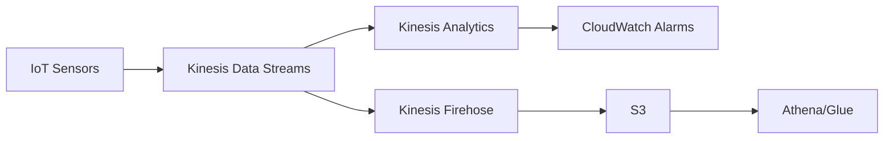
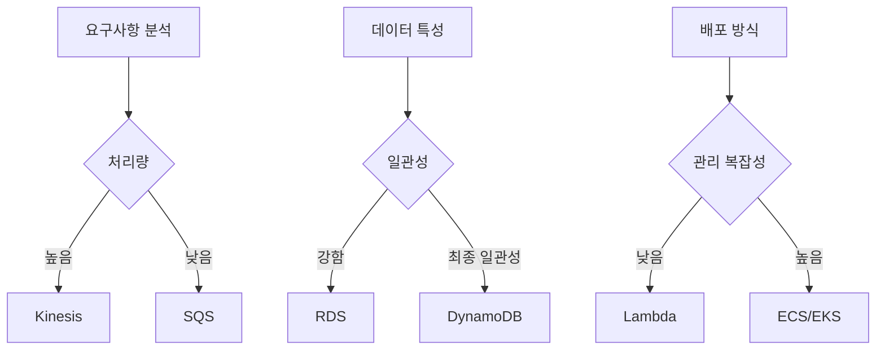

# AWS SAA 실전 문제 모음 - 핵심 시나리오별 아키텍처 설계

AWS Solutions Architect Associate(SAA) 시험에서 자주 출제되는 실전 문제들을 시나리오별로 정리하고 상세한 해설을 제공합니다. 각 문제는 실제 기업 환경에서 마주할 수 있는 상황을 기반으로 구성되었습니다.

## 🎯 문제 1: 글로벌 웹 애플리케이션 아키텍처

### 문제 상황
한국의 전자상거래 회사가 글로벌 진출을 계획하고 있습니다. 현재 서울 리전에만 배포된 웹 애플리케이션을 전 세계 사용자에게 빠른 응답 시간으로 서비스하려고 합니다.

**요구사항:**
- 전 세계 사용자에게 최적의 성능 제공
- 정적 콘텐츠(이미지, CSS, JS)의 빠른 로딩
- 동적 콘텐츠는 데이터 일관성 유지 필요
- 비용 효율적인 솔루션

**다음 중 가장 적절한 아키텍처는?**

**A)** 모든 리전에 동일한 애플리케이션 배포

**B)** CloudFront + S3 (정적 콘텐츠) + 서울 리전 ALB (동적 콘텐츠)

**C)** Route 53 Geolocation routing + 각 대륙별 리전 배포

**D)** Global Load Balancer + 서울 리전 단일 배포

### 💡 정답: B

**CloudFront + S3 (정적 콘텐츠) + 서울 리전 ALB (동적 콘텐츠)**

#### 상세 해설

**1. CloudFront의 역할**
- 전 세계 200+ Edge Location을 통한 콘텐츠 캐싱
- 사용자에게 가장 가까운 위치에서 콘텐츠 제공
- Origin Shield를 통한 캐시 히트율 향상

**2. 정적/동적 콘텐츠 분리 전략**
```yaml
CloudFront Behaviors:
  - PathPattern: /static/*
    Origin: S3 Bucket
    CachePolicyId: 658327ea-f89d-4fab-a63d-7e88639e58f6  # Managed-CachingOptimized
    
  - PathPattern: /api/*
    Origin: ALB (Seoul Region)
    CachePolicyId: 4135ea2d-6df8-44a3-9df3-4b5a84be39ad  # Managed-CachingDisabled
```

**3. 비용 최적화**
- S3 Standard-IA for 접근 빈도가 낮은 정적 콘텐츠
- CloudFront 캐싱으로 Origin 서버 부하 감소
- 서울 리전 단일 배포로 인프라 복잡성 최소화

---

## 🎯 문제 2: 실시간 데이터 처리 파이프라인

### 문제 상황
IoT 센서에서 초당 10,000개의 메시지를 전송하는 실시간 모니터링 시스템을 구축해야 합니다. 데이터는 실시간 분석과 장기 보관이 모두 필요합니다.

**요구사항:**
- 높은 처리량과 낮은 지연시간
- 데이터 손실 방지
- 실시간 분석 및 알람
- 비용 효율적인 장기 보관

**다음 중 가장 적절한 아키텍처는?**

**A)** SQS → Lambda → DynamoDB → S3

**B)** Kinesis Data Streams → Lambda → CloudWatch + S3

**C)** Kinesis Data Firehose → S3 → Athena

**D)** Kinesis Data Streams → Kinesis Analytics → CloudWatch Alarms + Kinesis Firehose → S3

### 💡 정답: D

**Kinesis Data Streams → Kinesis Analytics → CloudWatch Alarms + Kinesis Firehose → S3**

#### 상세 해설

**1. 아키텍처 구성요소**


**2. 각 서비스의 역할**
- **Kinesis Data Streams**: 실시간 데이터 수집 (초당 1,000,000 레코드)
- **Kinesis Analytics**: SQL 쿼리를 통한 실시간 분석
- **CloudWatch Alarms**: 임계값 기반 실시간 알람
- **Kinesis Firehose**: S3로의 자동 배치 로딩
- **S3**: 비용 효율적인 장기 보관

**3. 샤드 계산**
```
Required Shards = max(
    Input Rate / 1000 records per second,
    Output Rate / 2 MB per second
)

예시: 10,000 records/sec → 10 shards 필요
```

---

## 🎯 문제 3: 마이크로서비스 아키텍처 설계

### 문제 상황
기존 모놀리식 애플리케이션을 마이크로서비스로 전환하려고 합니다. 각 서비스는 독립적으로 배포되어야 하고, 서비스 간 통신은 비동기로 처리되어야 합니다.

**요구사항:**
- 서비스 간 느슨한 결합
- 장애 격리 및 복원력
- 자동 확장 및 배포
- 서비스 디스커버리

**다음 중 가장 적절한 아키텍처는?**

**A)** EC2 + ALB + RDS

**B)** ECS Fargate + Service Discovery + SQS + RDS Aurora Serverless

**C)** Lambda + API Gateway + DynamoDB

**D)** EKS + Istio + Kafka + MongoDB

### 💡 정답: B

**ECS Fargate + Service Discovery + SQS + RDS Aurora Serverless**

#### 상세 해설

**1. 컨테이너 오케스트레이션**
```yaml
# ECS Task Definition 예시
family: user-service
networkMode: awsvpc
requiresCompatibilities:
  - FARGATE
cpu: 256
memory: 512
taskRoleArn: arn:aws:iam::account:role/ecsTaskRole
executionRoleArn: arn:aws:iam::account:role/ecsTaskExecutionRole
```

**2. 서비스 디스커버리 설정**
```yaml
# Service Discovery
serviceName: user-service
namespace: microservices.local
dnsConfig:
  namespaceId: ns-12345
  routingPolicy: MULTIVALUE
  dnsRecords:
    - type: A
      ttl: 60
```

**3. 비동기 통신 패턴**
- **Event-driven**: SQS/SNS를 통한 서비스 간 통신
- **Request/Reply**: 동기적 호출이 필요한 경우 ALB 활용
- **Saga Pattern**: 분산 트랜잭션 관리

---

## 🎯 문제 4: 재해 복구 (DR) 전략

### 문제 상황
금융 서비스 회사가 99.99% 가용성을 보장하는 DR 전략을 수립해야 합니다. 현재 서울 리전에서 운영 중이며, RTO 15분, RPO 5분을 목표로 합니다.

**요구사항:**
- RTO (Recovery Time Objective): 15분
- RPO (Recovery Point Objective): 5분
- 자동 장애 조치
- 비용 최적화

**다음 중 가장 적절한 DR 전략은?**

**A)** Backup and Restore (Cold DR)

**B)** Pilot Light (Warm DR)

**C)** Warm Standby

**D)** Multi-Site Active/Active

### 💡 정답: C

**Warm Standby**

#### 상세 해설

**1. DR 전략 비교**

| 전략 | RTO | RPO | 비용 | 복잡성 |
|------|-----|-----|------|--------|
| Cold DR | 시간/일 | 시간 | 낮음 | 낮음 |
| Pilot Light | 시간 | 분 | 중간 | 중간 |
| **Warm Standby** | **분** | **분** | **높음** | **높음** |
| Active/Active | 초 | 거의 0 | 매우높음 | 매우높음 |

**2. Warm Standby 아키텍처**
```yaml
Primary Region (Seoul):
  - Production workload
  - Real-time data replication
  
Secondary Region (Tokyo):
  - Scaled-down instances (running)
  - Database standby (synchronized)
  - Load balancer (standby)
```

**3. 자동 장애 조치 구성**
```python
# Route 53 Health Check
{
    "Type": "A",
    "Name": "app.example.com",
    "SetIdentifier": "primary",
    "Failover": "PRIMARY",
    "AliasTarget": {
        "DNSName": "seoul-alb.elb.amazonaws.com",
        "EvaluateTargetHealth": True
    },
    "HealthCheckId": "health-check-seoul"
}
```

---

## 🎯 문제 5: 서버리스 이벤트 기반 아키텍처

### 문제 상황
이커머스 회사가 주문 처리 시스템을 서버리스로 구축하려고 합니다. 주문이 들어오면 재고 확인, 결제 처리, 배송 준비 등의 단계가 순차적으로 실행되어야 합니다.

**요구사항:**
- 각 단계별 독립적인 처리
- 실패 시 재시도 및 롤백
- 상태 추적 및 모니터링
- 비용 효율성

**다음 중 가장 적절한 아키텍처는?**

**A)** Lambda + SQS + DynamoDB

**B)** Step Functions + Lambda + EventBridge + DynamoDB

**C)** ECS + SQS + RDS

**D)** Lambda + SNS + SQS + RDS

### 💡 정답: B

**Step Functions + Lambda + EventBridge + DynamoDB**

#### 상세 해설

**1. Step Functions 워크플로우**
```json
{
  "Comment": "Order Processing Workflow",
  "StartAt": "ValidateOrder",
  "States": {
    "ValidateOrder": {
      "Type": "Task",
      "Resource": "arn:aws:lambda:region:account:function:validateOrder",
      "Next": "CheckInventory",
      "Retry": [
        {
          "ErrorEquals": ["States.ALL"],
          "IntervalSeconds": 2,
          "MaxAttempts": 3
        }
      ]
    },
    "CheckInventory": {
      "Type": "Task",
      "Resource": "arn:aws:lambda:region:account:function:checkInventory",
      "Next": "ProcessPayment"
    },
    "ProcessPayment": {
      "Type": "Task",
      "Resource": "arn:aws:lambda:region:account:function:processPayment",
      "Next": "PrepareShipment",
      "Catch": [
        {
          "ErrorEquals": ["PaymentFailed"],
          "Next": "RefundProcess"
        }
      ]
    },
    "PrepareShipment": {
      "Type": "Task",
      "Resource": "arn:aws:lambda:region:account:function:prepareShipment",
      "End": true
    },
    "RefundProcess": {
      "Type": "Task",
      "Resource": "arn:aws:lambda:region:account:function:processRefund",
      "End": true
    }
  }
}
```

**2. 이벤트 기반 통신**
```yaml
EventBridge Rules:
  - Name: OrderCreated
    EventPattern:
      source: ["order.service"]
      detail-type: ["Order Created"]
    Targets:
      - Arn: arn:aws:states:region:account:stateMachine:orderProcessing
  
  - Name: PaymentCompleted
    EventPattern:
      source: ["payment.service"]
      detail-type: ["Payment Completed"]
    Targets:
      - Arn: arn:aws:lambda:region:account:function:sendConfirmationEmail
```

**3. 비용 최적화 포인트**
- **Lambda**: 실행 시간만 과금, 자동 스케일링
- **Step Functions**: 상태 전환당 과금, 복잡한 오케스트레이션 불필요
- **DynamoDB**: On-demand 모드로 트래픽 변동에 대응
- **EventBridge**: 이벤트당 과금, 서비스 간 느슨한 결합

---

## 📊 핵심 학습 포인트

### 1. 아키텍처 설계 원칙
- **확장성**: Auto Scaling, Load Balancing
- **가용성**: Multi-AZ, Multi-Region
- **보안**: IAM, VPC, Encryption
- **비용 최적화**: Right-sizing, Reserved Instances

### 2. 서비스 선택 기준


### 3. 비용 최적화 전략
- **컴퓨팅**: Spot Instances, Reserved Instances
- **스토리지**: S3 Intelligent Tiering, Lifecycle Policy
- **네트워크**: CloudFront, VPC Endpoints
- **모니터링**: CloudWatch Logs Insights, X-Ray

## 🎓 시험 팁

1. **요구사항 우선순위**: 성능 > 비용 > 운영 복잡성
2. **AWS Well-Architected Framework** 5개 기둥 고려
3. **실제 운영 경험**을 바탕으로 한 최적 솔루션 선택
4. **트레이드오프** 이해: 비용 vs 성능 vs 복잡성

---

다음 포스트에서는 더 복잡한 엔터프라이즈 시나리오와 하이브리드 클라우드 아키텍처 문제들을 다루겠습니다. AWS SAA 시험 준비에 도움이 되었기를 바랍니다! 💪
