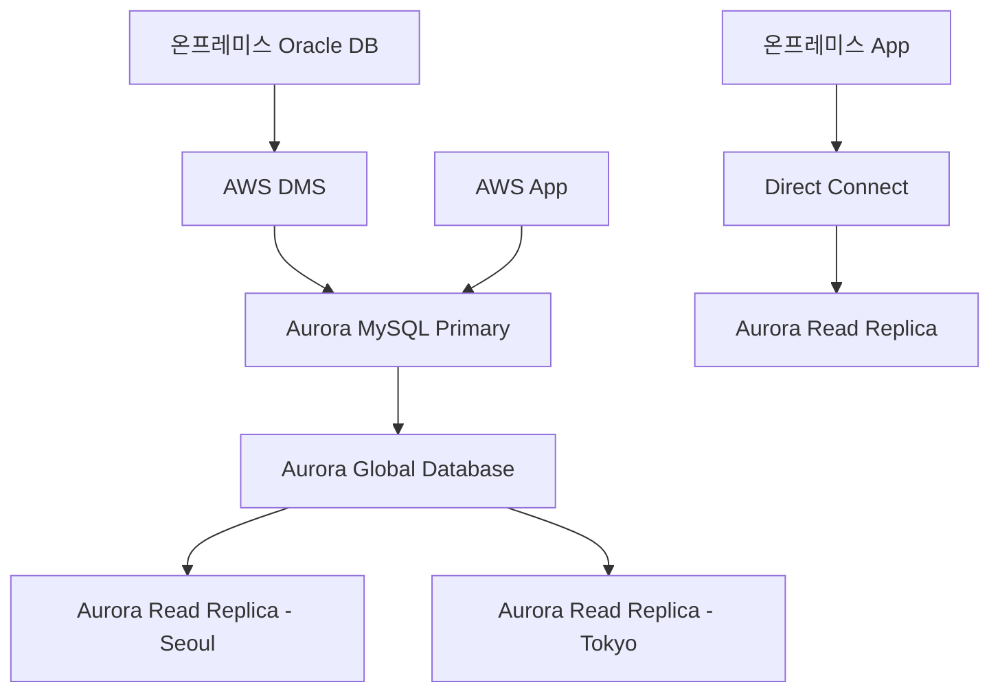
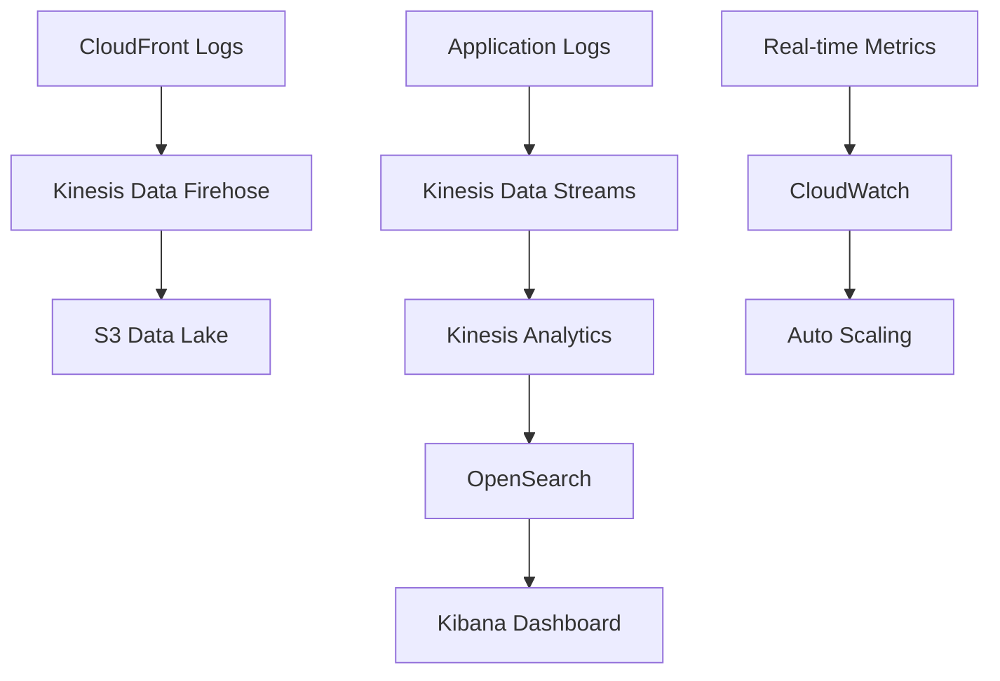
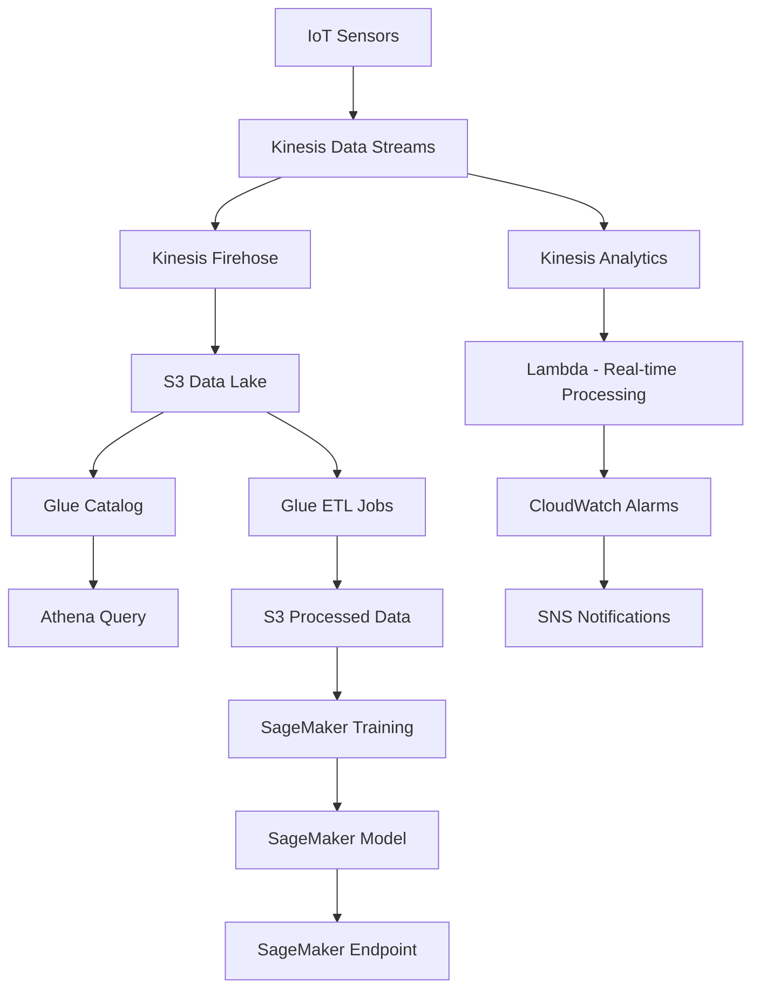
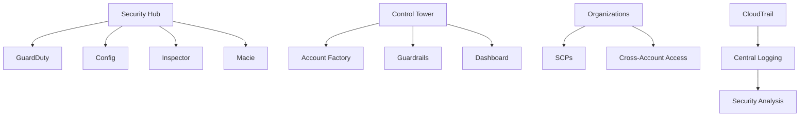

# AWS SAA 고급 시나리오 - 엔터프라이즈 하이브리드 클라우드 아키텍처 설계

AWS Solutions Architect Associate(SAA) 시험에서 점점 더 중요해지고 있는 엔터프라이즈 하이브리드 클라우드 시나리오를 다룹니다. 실제 대기업 환경에서 마주할 수 있는 복잡한 요구사항들을 AWS 서비스로 해결하는 방법을 학습해보겠습니다.

## 🎯 문제 1: 금융권 하이브리드 클라우드 마이그레이션

### 문제 상황
국내 대형 은행이 기존 온프레미스 시스템을 AWS로 점진적으로 마이그레이션하려고 합니다. 규제 요구사항과 보안 정책으로 인해 모든 시스템을 즉시 클라우드로 이전할 수 없는 상황입니다.

**요구사항:**
- 핵심 거래 시스템은 온프레미스 유지 (규제 요구사항)
- 고객 서비스 시스템은 AWS로 마이그레이션
- 온프레미스와 AWS 간 안전한 연결 (전용선)
- 데이터 동기화 및 실시간 복제
- 99.99% 가용성 보장
- 네트워크 지연시간 5ms 이하

**다음 중 가장 적절한 아키텍처는?**

**A)** VPN Gateway + Database Migration Service + Lambda

**B)** Direct Connect + AWS DataSync + EC2 + RDS Multi-AZ

**C)** Direct Connect + AWS Database Migration Service + Aurora Global Database + Transit Gateway

**D)** VPN Gateway + AWS Storage Gateway + EFS + ElastiCache

### 💡 정답: C

**Direct Connect + AWS Database Migration Service + Aurora Global Database + Transit Gateway**

#### 상세 해설

**1. 네트워크 아키텍처 설계**
```yaml
# Direct Connect 구성
DirectConnect:
  ConnectionSpeed: 10Gbps
  VLAN: 
    - Production: 100
    - Development: 200
  BGP:
    CustomerASN: 65000
    AmazonASN: 65001
  
# Transit Gateway 구성
TransitGateway:
  DefaultRouteTableAssociation: enable
  DefaultRouteTablePropagation: enable
  Attachments:
    - VPC-Production
    - VPC-Development  
    - DirectConnect-Gateway
```

**2. 데이터 동기화 전략**


**3. 실시간 복제 및 동기화**
- **AWS DMS**: 온프레미스 → Aurora 실시간 복제
- **Aurora Global Database**: 글로벌 재해 복구 및 읽기 성능 향상
- **Cross-Region 복제**: 1초 이내 RPO, 1분 이내 RTO

**4. 보안 및 네트워크 설계**
```yaml
# VPC 보안 설정
SecurityGroups:
  Database:
    Inbound:
      - Protocol: TCP
        Port: 3306
        Source: sg-application
        Description: "Application access"
      - Protocol: TCP
        Port: 3306
        Source: 192.168.0.0/16  # 온프레미스 CIDR
        Description: "On-premises access"
        
# Direct Connect Virtual Interface
VirtualInterface:
  Type: Private
  VLAN: 100
  BGP_ASN: 65000
  Customer_Address: 192.168.1.1/30
  Amazon_Address: 192.168.1.2/30
```

---

## 🎯 문제 2: 글로벌 미디어 스트리밍 플랫폼

### 문제 상황
글로벌 OTT 서비스 회사가 전 세계 사용자에게 고화질 비디오 스트리밍을 제공하려고 합니다. 피크 시간대에는 동시 접속자 수가 100만 명을 초과하며, 지역별로 다른 콘텐츠를 제공해야 합니다.

**요구사항:**
- 전 세계 사용자에게 일관된 스트리밍 품질
- 지역별 콘텐츠 필터링 및 권한 관리
- 실시간 시청 데이터 수집 및 분석
- 비용 효율적인 스토리지 및 CDN
- 자동 스케일링 및 부하 분산

**다음 중 가장 적절한 아키텍처는?**

**A)** CloudFront + S3 + Lambda@Edge + Kinesis + Elasticsearch

**B)** CloudFront + MediaConvert + MediaStore + ElastiCache + RDS

**C)** CloudFront + S3 + Lambda@Edge + Kinesis + OpenSearch + MediaLive

**D)** ALB + EC2 + EFS + Kinesis + DynamoDB + MediaPackage

### 💡 정답: C

**CloudFront + S3 + Lambda@Edge + Kinesis + OpenSearch + MediaLive**

#### 상세 해설

**1. 글로벌 콘텐츠 전송 아키텍처**
```yaml
# CloudFront 설정
CloudFrontDistribution:
  Origins:
    - DomainName: media-content.s3.amazonaws.com
      Id: S3-MediaContent
      S3OriginConfig:
        OriginAccessIdentity: origin-access-identity/cloudfront/ABCDEFG1234567
  
  DefaultCacheBehavior:
    TargetOriginId: S3-MediaContent
    ViewerProtocolPolicy: redirect-to-https
    CachePolicyId: 4135ea2d-6df8-44a3-9df3-4b5a84be39ad
    LambdaFunctionAssociations:
      - EventType: viewer-request
        LambdaFunctionARN: arn:aws:lambda:us-east-1:123456789012:function:GeoBlocking
```

**2. Lambda@Edge 활용**
```python
# 지역별 콘텐츠 필터링
import json

def lambda_handler(event, context):
    request = event['Records'][0]['cf']['request']
    headers = request['headers']
    
    # 사용자 위치 확인
    country = headers.get('x-forwarded-for', [{}])[0].get('value', '')
    
    # 지역별 콘텐츠 권한 확인
    if country in ['KR', 'JP', 'CN']:
        # 아시아 전용 콘텐츠 허용
        if '/asia-exclusive/' in request['uri']:
            return request
    
    # 기본 콘텐츠로 리다이렉트
    return {
        'status': '302',
        'statusDescription': 'Found',
        'headers': {
            'location': [{'key': 'Location', 'value': '/global-content/'}]
        }
    }
```

**3. 실시간 데이터 수집 및 분석**


**4. 미디어 처리 파이프라인**
```yaml
# MediaLive 채널 구성
MediaLiveChannel:
  InputSpecification:
    Codec: AVC
    Resolution: HD
    MaximumBitrate: MAX_10_MBPS
  
  EncoderSettings:
    VideoDescriptions:
      - Name: HD_1080p
        Width: 1920
        Height: 1080
        CodecSettings:
          H264Settings:
            Bitrate: 5000000
            RateControlMode: CBR
    
    OutputGroups:
      - Name: HLS_Output
        OutputGroupSettings:
          HlsGroupSettings:
            Destination: s3://media-output-bucket/live/
            SegmentLength: 6
            PlaylistType: EVENT
```

---

## 🎯 문제 3: IoT 대규모 데이터 처리 플랫폼

### 문제 상황
스마트 시티 프로젝트에서 도시 전체에 설치된 100,000개의 IoT 센서에서 실시간 데이터를 수집하고 분석해야 합니다. 각 센서는 1초마다 데이터를 전송하며, 실시간 알람과 배치 분석이 모두 필요합니다.

**요구사항:**
- 초당 100,000개 메시지 처리
- 실시간 이상 감지 및 알람
- 배치 분석을 위한 데이터 레이크
- 머신러닝 기반 예측 분석
- 99.9% 데이터 처리 보장

**다음 중 가장 적절한 아키텍처는?**

**A)** Kinesis Data Streams + Lambda + DynamoDB + S3 + Athena

**B)** MSK (Managed Kafka) + Kinesis Analytics + SageMaker + Glue + Redshift

**C)** Kinesis Data Streams + Kinesis Analytics + Lambda + S3 + Glue + SageMaker

**D)** SQS + Lambda + ElastiCache + RDS + QuickSight

### 💡 정답: C

**Kinesis Data Streams + Kinesis Analytics + Lambda + S3 + Glue + SageMaker**

#### 상세 해설

**1. 실시간 데이터 수집 및 처리**
```yaml
# Kinesis Data Streams 구성
KinesisStream:
  StreamName: iot-sensor-stream
  ShardCount: 100  # 초당 100,000 records = 100 shards
  RetentionPeriod: 24  # 24시간 보관
  
# 샤드 계산 공식
# Required Shards = max(
#   Records per second / 1,000,
#   Data size per second / 1 MB
# )
```

**2. 실시간 분석 및 알람**
```sql
-- Kinesis Analytics SQL 쿼리
CREATE OR REPLACE STREAM "DESTINATION_SQL_STREAM" (
    sensor_id VARCHAR(32),
    temperature DOUBLE,
    humidity DOUBLE,
    timestamp TIMESTAMP,
    anomaly_score DOUBLE
);

CREATE OR REPLACE PUMP "STREAM_PUMP" AS INSERT INTO "DESTINATION_SQL_STREAM"
SELECT STREAM 
    sensor_id,
    temperature,
    humidity,
    ROWTIME_TO_TIMESTAMP(ROWTIME) as timestamp,
    CASE 
        WHEN temperature > 35 OR humidity > 90 THEN 1.0
        ELSE 0.0
    END as anomaly_score
FROM "SOURCE_SQL_STREAM_001"
WHERE temperature > 30 OR humidity > 80;
```

**3. 데이터 레이크 아키텍처**


**4. 머신러닝 파이프라인**
```python
# SageMaker 모델 훈련
import boto3
import sagemaker
from sagemaker.sklearn.estimator import SKLearn

# 데이터 전처리
def preprocess_data():
    return """
    import pandas as pd
    from sklearn.preprocessing import StandardScaler
    from sklearn.ensemble import IsolationForest
    
    def main():
        # S3에서 데이터 로드
        df = pd.read_parquet('s3://iot-data-lake/processed/')
        
        # 특성 엔지니어링
        df['temp_humidity_ratio'] = df['temperature'] / df['humidity']
        df['temp_change'] = df['temperature'].diff()
        
        # 이상 탐지 모델 훈련
        model = IsolationForest(contamination=0.1)
        model.fit(df[['temperature', 'humidity', 'temp_humidity_ratio']])
        
        return model
    """

# SageMaker 훈련 작업
sklearn_estimator = SKLearn(
    entry_point='train.py',
    framework_version='0.23-1',
    instance_type='ml.m5.large',
    role=sagemaker.get_execution_role()
)

sklearn_estimator.fit({'training': 's3://iot-data-lake/training/'})
```

---

## 🎯 문제 4: 다중 계정 거버넌스 및 보안

### 문제 상황
대기업 그룹이 자회사별로 독립적인 AWS 계정을 운영하면서도, 중앙 집중식 보안 관리와 비용 최적화를 구현해야 합니다. 각 계정은 독립적으로 운영되지만 공통 보안 정책과 규정 준수가 필요합니다.

**요구사항:**
- 중앙 집중식 계정 관리
- 공통 보안 정책 적용
- 비용 추적 및 최적화
- 규정 준수 모니터링
- 교차 계정 리소스 공유

**다음 중 가장 적절한 아키텍처는?**

**A)** IAM Cross-Account Roles + CloudTrail + Config + Cost Explorer

**B)** AWS Organizations + SCPs + Control Tower + Security Hub + Cost and Billing

**C)** AWS Directory Service + SSO + CloudFormation + Trusted Advisor

**D)** AWS Config + Inspector + GuardDuty + Macie + Systems Manager

### 💡 정답: B

**AWS Organizations + SCPs + Control Tower + Security Hub + Cost and Billing**

#### 상세 해설

**1. 조직 구조 및 계정 관리**
```yaml
# Organizations 구조
OrganizationStructure:
  Root:
    - Security-OU:
        - Log-Archive-Account
        - Audit-Account
    - Production-OU:
        - ProductionAccount1
        - ProductionAccount2
    - Development-OU:
        - DevAccount1
        - DevAccount2
    - Sandbox-OU:
        - SandboxAccount1
```

**2. 서비스 제어 정책 (SCPs)**
```json
{
  "Version": "2012-10-17",
  "Statement": [
    {
      "Effect": "Deny",
      "Action": [
        "ec2:TerminateInstances",
        "rds:DeleteDBInstance",
        "s3:DeleteBucket"
      ],
      "Resource": "*",
      "Condition": {
        "StringNotEquals": {
          "aws:PrincipalTag/Department": "Operations"
        }
      }
    },
    {
      "Effect": "Deny",
      "Action": "ec2:RunInstances",
      "Resource": "arn:aws:ec2:*:*:instance/*",
      "Condition": {
        "StringNotEquals": {
          "ec2:InstanceType": [
            "t3.micro",
            "t3.small",
            "t3.medium"
          ]
        }
      }
    }
  ]
}
```

**3. 중앙 집중식 보안 관리**


**4. 비용 거버넌스**
```python
# 비용 최적화 Lambda 함수
import boto3
import json

def lambda_handler(event, context):
    ce_client = boto3.client('ce')
    
    # 계정별 비용 조회
    response = ce_client.get_cost_and_usage(
        TimePeriod={
            'Start': '2025-07-01',
            'End': '2025-07-31'
        },
        Granularity='MONTHLY',
        Metrics=['BlendedCost'],
        GroupBy=[
            {'Type': 'DIMENSION', 'Key': 'LINKED_ACCOUNT'},
            {'Type': 'DIMENSION', 'Key': 'SERVICE'}
        ]
    )
    
    # 비용 임계값 확인
    for result in response['ResultsByTime']:
        for group in result['Groups']:
            account_id = group['Keys'][0]
            service = group['Keys'][1]
            cost = float(group['Metrics']['BlendedCost']['Amount'])
            
            if cost > 1000:  # $1000 임계값
                send_alert(account_id, service, cost)
    
    return {
        'statusCode': 200,
        'body': json.dumps('Cost analysis completed')
    }
```

---

## 📊 핵심 학습 포인트

### 1. 엔터프라이즈 아키텍처 설계 원칙
- **거버넌스**: 중앙 집중식 관리 vs 분산 자율성
- **보안**: 심층 방어 전략 (Defense in Depth)
- **확장성**: 글로벌 스케일과 지역별 요구사항
- **규정 준수**: 산업별 규제 요구사항 고려

### 2. 하이브리드 클라우드 고려사항
```yaml
NetworkDesign:
  Connectivity:
    - DirectConnect: 전용선 연결
    - VPN: 백업 연결
    - TransitGateway: 중앙 집중식 네트워크 허브
  
  Security:
    - PrivateLink: 프라이빗 연결
    - WAF: 웹 애플리케이션 방화벽
    - Shield: DDoS 보호
  
  DataManagement:
    - DataSync: 온프레미스 데이터 동기화
    - DMS: 데이터베이스 마이그레이션
    - StorageGateway: 하이브리드 스토리지
```

### 3. 대규모 시스템 설계 패턴
- **Event-Driven Architecture**: 마이크로서비스 간 느슨한 결합
- **CQRS**: 읽기/쓰기 분리로 성능 최적화
- **Circuit Breaker**: 장애 전파 방지
- **Bulkhead**: 리소스 격리로 안정성 향상

## 🎓 고급 시험 팁

### 1. 복합 시나리오 분석법
```
1. 요구사항 우선순위 분석
   - 비즈니스 크리티컬 > 성능 > 비용
   
2. 제약조건 식별
   - 규제 요구사항
   - 기술적 제약
   - 예산 제한
   
3. 트레이드오프 고려
   - 성능 vs 비용
   - 복잡성 vs 유지보수성
   - 보안 vs 편의성
```

### 2. 서비스 조합 전략
- **단일 서비스 솔루션**: 간단하지만 제한적
- **다중 서비스 조합**: 복잡하지만 유연함
- **관리형 서비스 우선**: 운영 부담 최소화

### 3. 실무 경험 활용
- **레퍼런스 아키텍처** 숙지
- **Well-Architected Framework** 적용
- **비용 최적화** 베스트 프랙티스

---

이번 포스트에서는 AWS SAA 시험의 고급 시나리오들을 다뤘습니다. 실제 엔터프라이즈 환경에서 마주할 수 있는 복잡한 요구사항들을 AWS 서비스 조합으로 해결하는 방법을 학습했습니다. 

다음 포스트에서는 최신 AWS 서비스들을 활용한 혁신적인 아키텍처 패턴들을 다루겠습니다. 시험 준비에 도움이 되었기를 바랍니다! 🚀
