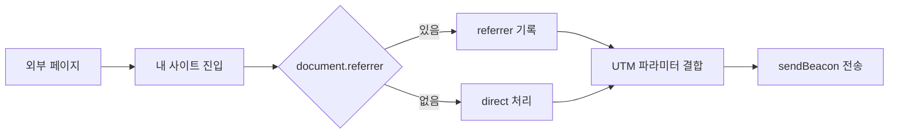

## 목차
1. [소개](#소개)
2. [document.referrer는 무엇을 알려주나](#documentreferrer는-무엇을-알려주나)
3. [실제 사용처](#실제-사용처)
4. [값이 비어 있을 수 있는 이유](#값이-비어-있을-수-있는-이유)
5. [Referrer-Policy를 꼭 확인하자](#referrer-policy를-꼭-확인하자)
6. [함께 알아두면 좋은 브라우저 정보들](#함께-알아두면-좋은-브라우저-정보들)
7. [브라우저 기능을 조합할 때 주의할 점](#브라우저-기능을-조합할-때-주의할-점)
8. [실전 체크리스트](#실전-체크리스트)
9. [정리](#정리)

## 소개

내가 만든 사이트에 사용자가 어떤 경로로 들어왔는지 알고 싶어서 `document.referrer`를 사용해 본 적이 있다면, 그 값이 종종 비어 있거나 기대와 다르게 나오는 경험도 했을 것이다. 이 글에서는 `document.referrer`의 기본 동작과 실제 사용처를 정리하고, 그 한계를 보완하는 브라우저 기능과 함께 알아두면 좋은 것들을 한 번에 정리한다.

## document.referrer는 무엇을 알려주나

`document.referrer`는 현재 문서로 이동하기 직전 문서의 URL을 문자열로 제공한다. 사용자는 검색 엔진, 외부 블로그, 광고 링크 등 다양한 곳에서 들어오는데, 이 값 하나만으로도 대략적인 유입 경로를 파악할 수 있다.

```js
console.log(document.referrer);
// "https://example.com/some-page" 같은 값이 출력된다.
```

## 실제 사용처

가장 흔한 사용처는 간단한 유입 분석이다. 별도의 분석 도구 없이도 방문자가 외부 사이트에서 왔는지, 같은 도메인의 내부 이동인지 빠르게 구분할 수 있다.

또 다른 사용처는 UX 개선이다. 예를 들어, 외부 검색에서 유입된 사용자에게는 요약 섹션을 먼저 보여주고, 내부 이동 사용자에게는 이어서 읽기 링크를 우선 제공하는 식의 분기 처리를 할 수 있다.

운영 관점에서는 간단한 탐지에도 쓸 수 있다. 특정 파트너 도메인에서 유입된 요청만 별도 배너를 노출하거나, 예상치 못한 대량 유입의 출처를 빠르게 확인하는 데 유용하다.

## 값이 비어 있을 수 있는 이유

`document.referrer`는 항상 채워지지 않는다. 대표적으로 주소창 직접 입력, 북마크, 메신저 앱의 링크 공유, HTTPS에서 HTTP로 이동하는 경우 등이 있다. 브라우저와 사이트의 보안 정책에 따라 referrer가 아예 전달되지 않거나, 도메인까지만 전달되기도 한다.

또한 웹뷰나 인앱 브라우저는 referrer를 의도적으로 비우기도 하고, 중간에 리다이렉트가 여러 번 발생하면 최종 referrer가 달라질 수 있다. 그래서 referrer만으로 유입 경로를 100% 확정하는 것은 위험하다.

## Referrer-Policy를 꼭 확인하자

referrer 정보는 `Referrer-Policy`에 의해 조절된다. 기본값은 보통 `strict-origin-when-cross-origin`이며, 이 경우 동일 출처 이동은 전체 URL, 교차 출처 이동은 도메인까지만 전달된다. 보안이나 개인정보 노출을 줄이려면 적절한 정책을 명시하는 것이 안전하다.

정책을 HTML 메타로 설정할 수도 있고, 서버 응답 헤더로 설정할 수도 있다. 여러 페이지에서 일관되게 동작해야 한다면 헤더 설정이 더 안정적이다.

```html
<meta name="referrer" content="strict-origin-when-cross-origin">
```

```http
Referrer-Policy: strict-origin-when-cross-origin
```

정책별로 어떤 정보가 전달되는지 감을 잡기 위해 간단한 비교표를 참고하면 좋다.

| 정책 | 동일 출처 이동 | 교차 출처 이동 | 비고 |
| --- | --- | --- | --- |
| `no-referrer` | 전달 안 함 | 전달 안 함 | 가장 엄격 |
| `origin` | 도메인만 | 도메인만 | 경로 숨김 |
| `strict-origin-when-cross-origin` | 전체 URL | 도메인만 | 현재 기본값 |
| `unsafe-url` | 전체 URL | 전체 URL | 개인정보 위험 |

## 함께 알아두면 좋은 브라우저 정보들

`document.referrer`만으로 부족할 때는 URL 파라미터나 브라우저 이벤트를 함께 사용하면 보완이 된다. 특히 캠페인 분석에는 UTM 파라미터가 더 안정적이다.

```js
const params = new URLSearchParams(location.search);
const campaign = {
  referrer: document.referrer || "direct",
  source: params.get("utm_source"),
  medium: params.get("utm_medium"),
  campaign: params.get("utm_campaign")
};
```

페이지 전환 시점에 정보를 안전하게 남기려면 `navigator.sendBeacon()`이 유용하다. 페이지가 닫히는 순간에도 데이터를 안정적으로 전송할 수 있어서 클라이언트 로그 수집에 적합하다.

```js
const payload = JSON.stringify({
  referrer: document.referrer || "direct",
  path: location.pathname,
  ts: Date.now()
});

navigator.sendBeacon("/api/collect", payload);
```

입력 경로를 더 정확히 추적하고 싶다면 `history`를 활용해 내부 이동 흐름을 기록할 수 있다. SPA라면 라우팅 이벤트에서 이전 경로와 현재 경로를 저장하는 방식이 현실적이다.

사용자 환경 정보를 가볍게 파악하고 싶다면 `navigator.language`, `Intl.DateTimeFormat().resolvedOptions().timeZone`, `screen` 정보 정도가 흔히 쓰인다. 이는 콘텐츠의 기본 언어 선택이나 시간대 기반 UI에 도움이 된다.

```js
const clientInfo = {
  lang: navigator.language,
  tz: Intl.DateTimeFormat().resolvedOptions().timeZone,
  screen: `${screen.width}x${screen.height}`
};
```

성능 측정은 `performance` API로 접근하면 된다. 첫 로드 성능이나 특정 이벤트에 대한 지연을 기록하면 유입 채널별 성능 차이를 확인할 수 있다.

```js
const navEntry = performance.getEntriesByType("navigation")[0];
const perf = {
  ttfb: navEntry.responseStart - navEntry.requestStart,
  domLoad: navEntry.domContentLoadedEventEnd - navEntry.startTime
};
```

네트워크 상황은 `navigator.connection`으로 대략적인 힌트를 얻을 수 있다. 단, 모든 브라우저에서 지원하지 않으므로 선택적으로 사용해야 한다.

```js
const connection = navigator.connection || {};
const net = {
  type: connection.effectiveType,
  downlink: connection.downlink
};
```

유입 경로 기록이 실제로 어떻게 흐르는지 한 번 정리해 보면 이해가 빠르다.



현실적으로는 한 번의 전송으로 끝내기보다, 실패 시 재전송을 고려한 큐 방식이 안정적이다. 단순히 메모리에 쌓아두고 다음 페이지 진입 시 함께 보내는 정도만 해도 로그 손실이 크게 줄어든다.

## 브라우저 기능을 조합할 때 주의할 점

`document.referrer`는 개인정보와 연결될 수 있으므로 민감한 정보를 포함한 전체 URL을 서버에 그대로 저장하지 않는 것이 좋다. 필요한 범위만 수집하고, 저장 기간과 목적을 명확히 하는 것이 안전하다.

또한 사용자 식별을 위해 `userAgent`에 의존하는 방식은 점점 부정확해진다. 브라우저는 프라이버시 보호를 위해 UA를 축약하거나 고정하는 추세이므로, 필요한 경우 Client Hints 사용을 고려하는 것이 좋다.

Client Hints는 서버가 필요한 정보만 요청하는 방식이다. 예를 들어, 화면 크기나 플랫폼 정보를 선택적으로 수집할 수 있다.

```http
Accept-CH: Sec-CH-UA-Platform, Sec-CH-UA-Mobile
```

수집 정보를 늘릴수록 법적 책임과 운영 부담이 커진다. 최소 수집, 목적 제한, 짧은 보관 기간 원칙을 지키는 것이 장기적으로 안전하다.

## 실전 체크리스트

아래 항목을 간단히 점검하면 referrer 기반 유입 분석을 안정적으로 운영할 수 있다.

- Referrer-Policy를 명확히 설정했는가
- `document.referrer`가 비는 케이스를 고려했는가
- UTM 파라미터를 기본 유입 식별자로 사용하고 있는가
- `sendBeacon`으로 종료 시점 로그를 남기는가
- 개인정보나 민감한 URL 파라미터를 저장하지 않는가

## 예시: 최소 수집 로그 구조

실제로 저장하는 로그는 최소한의 필드만으로 충분하다. 아래 형태면 유입 출처와 캠페인 성과를 추적하는 데 필요한 핵심 정보를 담을 수 있다.

수집 전에 referrer와 파라미터를 정리하는 함수를 하나 두면 민감 정보 누출을 줄일 수 있다.

```js
const SENSITIVE_KEYS = ["token", "session", "password", "auth"];

const sanitizeUrl = (rawUrl) => {
  try {
    const url = new URL(rawUrl);
    for (const key of SENSITIVE_KEYS) {
      if (url.searchParams.has(key)) {
        url.searchParams.delete(key);
      }
    }
    url.hash = "";
    return url.origin + url.pathname + (url.search ? url.search : "");
  } catch {
    return "";
  }
};

const safeReferrer = sanitizeUrl(document.referrer || "");
```

```json
{
  "ts": 1708560000000,
  "path": "/posts/referrer-guide",
  "referrer": "https://example.com",
  "utm": {
    "source": "newsletter",
    "medium": "email",
    "campaign": "feb-2026"
  }
}
```

## 정리

`document.referrer`는 빠르고 간단한 유입 경로 확인 도구지만, 항상 값을 제공하지는 않는다. 따라서 Referrer-Policy와 UTM 파라미터, `sendBeacon` 같은 기능을 함께 사용하면 더 신뢰도 높은 데이터 수집이 가능하다. 브라우저의 보안 정책과 개인정보 보호 흐름을 이해하고, 필요한 만큼만 수집하는 습관을 들이면 안정적인 운영에 도움이 된다.
