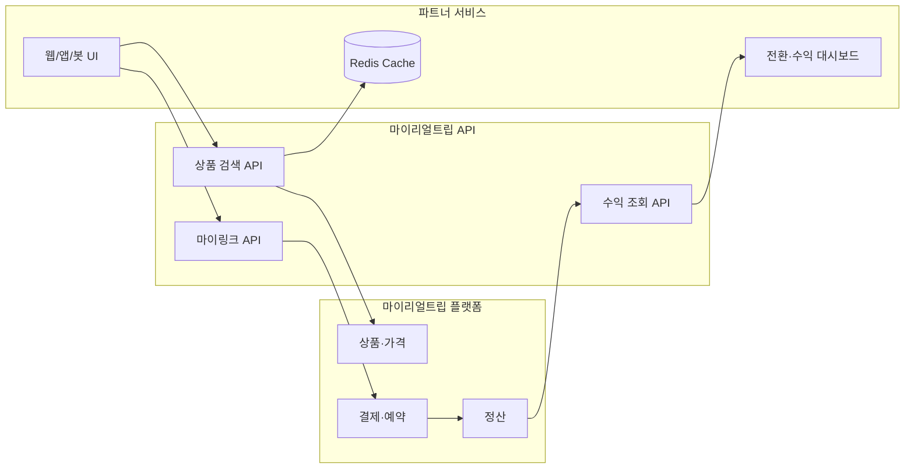

# 마이리얼트립 API 분석과 수익 극대화 전략 — 파트너 API·MCP·CPS 어필리에이트 실전 가이드 2026

2026년 4월, 마이리얼트립은 **마케팅 파트너 API**와 **MCP 서버**를 외부 개발자에게 공개했습니다.

> 예전: 블로그·인스타에 홍보 링크 붙이기 → 클릭 기대  
> 지금: 항공 최저가 비교 앱, AI 여행 에이전트, 가격 알림 봇 → **검색·추천·전환까지 코드로 설계**

공식 팀의 표현대로, 여행 어필리에이트는 콘텐츠 중심에서 **서비스(코드) 중심**으로 이동하고 있습니다. 파트너사 A·B는 API 연동 후 **월 최고 거래액 28억·12억 원** 수준의 실적이 공개되었고, [flightdeal.kr](https://flightdeal.kr/)·캐치프로그 같은 서비스가 이미 운영 중입니다.

이 글은 API 스펙 나열이 아니라, **API를 분석해 수익을 극대화하는 비즈니스 구상·기술 설계·운영 전략**을 한 장의 지도로 정리합니다.

> 키워드·SEO 기반 트래픽 설계는 [네이버 키워드 API 가이드](/2026/03/14/naver-keyword-ad-api-django-ninja-integration/)와 [SEO 최적화 가이드](/2026/03/06/complete-seo-optimization-strategy-guide/)를, 1인 SaaS 관점은 [AI 구독 서비스 전략](/2026/06/01/ai-solo-founder-subscription-global-strategy/)을 함께 보면 좋습니다.

---

## 0. 결론부터: 수익 극대화의 4축

| 축 | 한 줄 | 실패 신호 |
|---|---|---|
| **Intent** | “지금 살 이유”가 있는 트래픽 | 조회수만 많고 예약 0건 |
| **AOV** | 객단가 높은 상품·구간에 집중 | 저가 투어 링크만 반복 노출 |
| **Conversion** | 검색 → 마이링크 → MRT 결제 경로가 짧고 명확 | API 결과와 결제 페이지 불일치 |
| **Retention** | 재방문·알림·구독으로 7일 쿠키 창을 넓힘 | 일회성 랜딩만 운영 |

**가장 흔한 실수**는 API 키만 받아 “스카이스캐너 클론”을 만드는 것입니다. 마이리얼트립 API의 본질은 **검색 인프라 + CPS 정산 인프라**이고, 수익은 **니치·타이밍·신뢰**에서 갈립니다.

---

## 1. 마이리얼트립 파트너 API란 무엇인가

### 1.1 포지셔닝: B2B2C 어필리에이트 인프라

마이리얼트립 마케팅 파트너 API는 **예약 시스템을 직접 구축하는 API가 아닙니다.**

공식 팀이 GeekNews 댓글에서 밝힌 설계 흐름은 다음과 같습니다.

```
서비스 API(항공/숙소/투어 조회)
  → 내 앱·사이트에 결과 노출
  → 마이링크 API로 어필리에이트 URL 생성
  → 사용자가 클릭해 마이리얼트립으로 이동
  → MRT에서 예약·결제 완료
  → 클릭 후 7일 이내 전환 시 수수료 발생
```

즉 파트너의 역할은 **보여주고 보내기(Search + Link)** 입니다. 상품 소싱, 결제, 24시간 CS, 정산은 마이리얼트립이 담당합니다(Zero Operation).

### 1.2 수익 구조 (CPS)

| 항목 | 내용 |
|---|---|
| **모델** | CPS (Cost Per Sale) — 실결제 금액 기준 |
| **수수료** | MRT 중개 수수료의 **50%** 정산 → 실질 **판매액 최대 7%** (상품·카테고리별 상이) |
| **어트리뷰션** | **클릭 후 7일** 쿠키 기준 |
| **정산** | **익월 30일** |
| **인센티브** | 누적 판매액 구간별 **보너스** (공식 문서·파트너 센터 확인) |

개인 개발자는 [파트너 가입](https://partner.myrealtrip.com/welcome/marketing_partner) 즉시 API 키 발급이 가능하고, 법인은 사업자등록증·통장 사본 제출 후 `marketing_partner@myrealtrip.com`으로 승인 요청합니다.

### 1.3 API·도구 구성

| 구분 | 역할 | 비고 |
|---|---|---|
| **항공권 조회 API** | 날짜별 최저가, 다중 목적지 비교 | `/v1/products/flight/calendar` 등 |
| **숙소 검색 API** | 실시간 가격·리뷰 | |
| **투어티켓 검색 API** | 투어·티켓·액티비티 | 2026년 4월 기준 순차 오픈 |
| **마이링크 API** | 수익 추적 가능한 홍보 URL 생성 | **수익화의 핵심** |
| **수익 조회 API** | 예약·수익 실시간 확인 | KPI 대시보드용 |
| **MCP 서버** | Cursor·Claude에서 상품 검색 | 인증 없이 프로토타입 가능 |

- **개발자 센터**: [docs.myrealtrip.com](https://docs.myrealtrip.com/)
- **MCP 엔드포인트**: `https://mcp-servers.myrealtrip.com/mcp`

```json
{
  "mcpServers": {
    "myrealtrip": {
      "url": "https://mcp-servers.myrealtrip.com/mcp"
    }
  }
}
```

MCP는 **수익 정산과 무관**합니다. 프로토타입·AI 에이전트 실험용이고, 매출을 내려면 **파트너 API 키 + 마이링크**가 필수입니다.

---

## 2. API 아키텍처 분석

### 2.1 레이어 구조



### 2.2 항공 API — 알아둘 제약

GeekNews 피드백에 따르면 **`/v1/products/flight/calendar`는 국제선만 지원**합니다. GMP→CJU 같은 국내선은 빈 배열(`data: []`)이 정상 응답입니다.

```json
{
  "depCityCd": "ICN",
  "arrCityCd": "NRT",
  "period": 3,
  "startDate": "2026-07-01",
  "endDate": "2026-08-31"
}
```

**수익 전략 함의**: 국내선 특가 서비스보다 **국제선·장거리·고객단가 높은 구간**이 API 현 시점과 잘 맞습니다.

### 2.3 문서·AI 코딩 시 주의

개발자 센터가 SPA(클라이언트 렌더링)라 Cursor·Claude에 URL만 던지면 내용을 못 읽는 경우가 있습니다. 연동 시:

1. [docs.myrealtrip.com](https://docs.myrealtrip.com/)에서 필요한 페이지를 **로컬 Markdown으로 복사**해 컨텍스트에 넣기
2. 첫 호출은 **Postman/curl로 검증** 후 코드 생성
3. 공식 팀에 정적 문서·Markdown export 요청 가능 (`marketing_partner@myrealtrip.com`)

---

## 3. 수익 극대화 공식

단순히 “API 호출 수 × 전환율”이 아니라, **기대 수익(E)** 은 다음으로 근사할 수 있습니다.

```
E = Traffic × CTR × BookingRate × AOV × CommissionRate × (1 - ChurnBeforePurchase)
```

| 변수 | 뜻 | 극대화 방법 |
|---|---|---|
| **Traffic** | 유입 | SEO·커뮤니티·뉴스레터·앱스토어 |
| **CTR** | 검색 결과 → MRT 클릭 | 가격·한정·리뷰·CTA |
| **BookingRate** | MRT 내 결제 전환 | 의도 높은 키워드·구체적 일정 |
| **AOV** | 1건당 결제액 | 항공+숙소·장기·프리미엄 |
| **CommissionRate** | 수수료율 (최대 7%) | 카테고리별 상품 믹스 |
| **ChurnBeforePurchase** | 7일 내 이탈 | 리마인더·가격 변동 알림 |

**레버가 큰 순서**(일반적): **AOV > BookingRate > Traffic > CTR**. 저가 트래픽 100만보다 **“다음 달 오사카 3박, 일정 확정”** 유저 1,000명이 수익에 유리한 경우가 많습니다.

### 3.1 카테고리별 수익 특성 (실무 관점)

| 카테고리 | AOV | 구매 주기 | API 활용도 | 추천 전략 |
|---|---|---|---|---|
| **국제 항공** | 높음 | 길음(수주~수개월) | 높음 | 최저가 캘린더·가격 알림 |
| **숙소** | 중~높음 | 항공과 연동 | 높음 | 목적지+날짜 랜딩 SEO |
| **투어·티켓** | 중간 | 짧음 | 중간 | 일정 확정 후 업셀 |
| **패키지·기획전** | 높음 | 시즌성 | 링크 위주 | 시즌 캠페인 페이지 |

### 3.2 7일 쿠키 창을 넓히는 설계

쿠키가 7일이므로 **당일 결제만 노리는 UI는 손해**입니다.

- **찜·알림·이메일 구독**: 가격 하락 시 재유입
- **일정 비교 저장**: “3개 후보 중 고르기” 플로우
- **리타겟 콘텐츠**: “지난번 본 도쿄 숙소, 이번 주 12% 하락”

[AI Report 직원](/2026/05/30/ai-report-employee-daily-briefing-automation/)으로 **일일 특가·가격 변동 브리핑**을 자동화하면 운영 비용 없이 리텐션 레버를 당길 수 있습니다.

---

## 4. 비즈니스 모델 7가지 — 무엇을 만들 것인가

### 4.1 모델 비교표

| # | 모델 | 난이도 | 수익 천장 | 차별화 포인트 |
|---|---|---|---|---|
| 1 | **항공 최저가 알리미** | 중 | 높음 | 구간·날짜 니치 (flightdeal.kr 유형) |
| 2 | **목적지 SEO 허브** | 중 | 중~높음 | “{도시} {월} 최저가 항공” 장문 랜딩 |
| 3 | **AI 여행 플래너** | 중~상 | 중 | MCP+파트너 API, 일정→링크 일괄 생성 |
| 4 | **커뮤니티·봇** | 하~중 | 중 | 텔레그램·디스코드 특가 채널 |
| 5 | **뉴스레터·구독** | 하 | 중 | [구독 모델](/2026/06/01/ai-solo-founder-subscription-global-strategy/) + CPS |
| 6 | **B2B 위젯** | 상 | 높음 | 여행사·블로그에 검색 위젯 임베드 |
| 7 | **버티컬 SaaS** | 상 | 높음 | 허니문·골프·출장 등 세그먼트 특화 |

### 4.2 1인·인디해커에게 유리한 조합

**추천 스택 (MVP 2~4주)**:

1. **니치 1개** (예: “동남아 직항 최저가”, “유럽 성수기 역주행”)  
2. **Next.js 랜딩 + Django Ninja API 프록시** (API 키 서버 보관)  
3. **Celery Beat**으로 가격 스냅샷·알림 ([스케줄 가이드](/2026/03/24/django-ninja-celery-beat-complete-guide/))  
4. **수익 조회 API**로 주간 KPI 대시보드

### 4.3 피해야 할 함정

| 함정 | 이유 |
|---|---|
| **범용 메타서치** | 스카이스캐너·구글 플라이트와 정면 충돌 |
| **API 키 클라이언트 노출** | 키 탈취·정산 소명 곤란 |
| **가격 데이터 무캐시 폴링** | 레이트 리밋·비용 폭증 |
| **저가 투어만 링크** | AOV·수수료 절대액 낮음 |
| **쿠키 안내·광고 표기 누락** | 표시광고·어필리에이트 공정거래 리스크 |

---

## 5. 기술 설계 — Django Ninja 연동 예시

### 5.1 아키텍처 원칙

```
[Browser/App] → [Next.js] → [Django Ninja BFF] → [MRT Partner API]
                              ↑
                         API Key (서버만)
                         Redis Cache
                         PostgreSQL (검색 로그·스냅샷)
```

- **API 키는 반드시 백엔드**에만 둡니다.
- 검색 결과는 **짧은 TTL 캐시**(예: 항공 15~30분, 숙소 5~15분).
- 클릭·전환은 **자체 UTM + 마이링크**로 이중 추적합니다.

### 5.2 환경 변수

```bash
# .env (서버 전용 — Git 커밋 금지)
MYREALTRIP_API_KEY=your_partner_api_key
MYREALTRIP_API_BASE=https://api.myrealtrip.com  # 공식 문서 기준 URL 확인
REDIS_URL=redis://localhost:6379/0
```

### 5.3 항공 최저가 프록시 (개념 코드)

> 엔드포인트·헤더·응답 필드는 [공식 문서](https://docs.myrealtrip.com/) 최신 스펙을 따르세요. 아래는 **설계 패턴** 예시입니다.

```python
# services/myrealtrip.py
import hashlib
import httpx
from django.conf import settings
from django.core.cache import cache

class MyRealTripClient:
    def __init__(self):
        self.base = settings.MYREALTRIP_API_BASE
        self.headers = {
            "Authorization": f"Bearer {settings.MYREALTRIP_API_KEY}",
            "Content-Type": "application/json",
        }

    def _cache_key(self, prefix: str, payload: dict) -> str:
        raw = prefix + str(sorted(payload.items()))
        return f"mrt:{hashlib.sha256(raw.encode()).hexdigest()[:16]}"

    async def search_flight_calendar(self, params: dict) -> dict:
        key = self._cache_key("flight", params)
        cached = cache.get(key)
        if cached:
            return cached

        async with httpx.AsyncClient(timeout=30.0) as client:
            resp = await client.get(
                f"{self.base}/v1/products/flight/calendar",
                headers=self.headers,
                params=params,
            )
            resp.raise_for_status()
            data = resp.json()

        cache.set(key, data, timeout=60 * 20)  # 20분
        return data
```

```python
# api/flights.py — Django Ninja
from ninja import Router, Schema
from services.myrealtrip import MyRealTripClient

router = Router()
client = MyRealTripClient()

class FlightSearchIn(Schema):
    dep_city_cd: str
    arr_city_cd: str
    period: int = 3
    start_date: str
    end_date: str

@router.post("/flights/calendar")
async def flight_calendar(request, payload: FlightSearchIn):
    data = await client.search_flight_calendar(payload.dict())
    # 클릭 추적용 search_id를 DB에 저장하면 퍼널 분석에 유리
    return {"results": data.get("data", []), "meta": data.get("meta", {})}
```

### 5.4 마이링크 생성 — 수익의 마지막 1cm

검색 API만 쓰고 **일반 MRT URL**을 붙이면 어트리뷰션이 안 될 수 있습니다. **반드시 마이링크 API**로 URL을 생성하세요.

```python
async def create_affiliate_link(self, target_url: str, campaign: str) -> str:
    async with httpx.AsyncClient(timeout=15.0) as client:
        resp = await client.post(
            f"{self.base}/v1/links",  # 실제 경로는 공식 문서 확인
            headers=self.headers,
            json={"url": target_url, "campaign": campaign},
        )
        resp.raise_for_status()
        return resp.json()["data"]["shortUrl"]
```

**UX 패턴**:

- 카드마다 `예약하러 가기` 버튼 → 마이링크  
- `가격 비교 중…` 스켈레톤 후 CTA 노출 (신뢰↑)  
- 외부 링크임을 한 줄 표기 (어필리에이트 고지)

### 5.5 수익 대시보드

수익 조회 API로 **일·주·월 GMV·건수·수수료**를 Pull해 대시보드에 띄웁니다.

| 지표 | 용도 |
|---|---|
| **GMV** | 규모·인센티브 구간 예측 |
| **전환 건수** | 콘텐츠·구간별 성과 |
| **EPC** (수익/클릭) | SEO·광고 ROI |
| **구간별 AOV** | 다음 니치 선정 |

---

## 6. 트래픽·전환 전략

### 6.1 SEO — “질문 단위 URL”

[SEO 가이드](/2026/03/06/complete-seo-optimization-strategy-guide/)와 동일하게, **키워드 1개 = 페이지 1개**가 아니라 **질문 1개 = 페이지 1개**입니다.

| URL 패턴 | 타겟 질문 |
|---|---|
| `/flights/icn-bkk-july` | 7월 방콕 최저가 언제? |
| `/hotels/osaka-family` | 오사카 가족여행 숙소 추천 가격 |
| `/alerts/nrt-under-300k` | 도쿄 30만 원 이하 항공 알림 |

각 페이지 상단에 **Answer Chunk**(한 줄 답) + 표 + 마이링크 CTA를 두면 검색·[AEO](/2026/06/03/web-service-aeo-optimization-complete-guide/) 모두에 유리합니다.

### 6.2 키워드 리서치 자동화

[네이버 키워드 API](/2026/03/14/naver-keyword-ad-api-django-ninja-integration/)로 “{도시} 항공권”, “{도시} 숙소 추천” 검색량을 뽑고, **검색량 × 예상 AOV × 경쟁도**로 우선순위를 매깁니다.

### 6.3 전환율(CTR) 올리는 UI

- **가격·날짜·잔여 좌석(가능 시)** 명시  
- **“마지막 확인: {시각}”** 신선도 표시  
- **비교 테이블** (날짜 3~5개 열)  
- 모바일에서 **CTA 고정 하단 바**

### 6.4 시즌·이벤트 캘린더

| 시기 | 액션 |
|---|---|
| 설·추석 연휴 | 근거리 국제선·숙소 랜딩 |
| 여름 성수기 | 2~3개월 전 “얼리버드” 알림 수집 |
| 환율 급변 | “지금이 싼 이유” 콘텐츠 |
| 항공사 세일 | Celery로 API 폴링 → 푸시/메일 |

---

## 7. AI·MCP 활용 전략

### 7.1 MCP vs 파트너 API 역할 분리

| 단계 | 도구 |
|---|---|
| 아이디어·프로토타입 | MCP (Cursor/Claude) |
| 프로덕션 검색·링크 | 파트너 API |
| 수익 확인 | 수익 조회 API |

BuildWithTrae 해커톤 사례처럼 **MCP로 AI 여행 에이전트**를 만든 뒤, 실서비스에서는 파트너 API로 교체하는 패턴이 현실적입니다.

### 7.2 AI 에이전트 수익 모델

```
사용자: "12월 제주 대신 오키나와 4박, 예산 150만"
  → 에이전트가 항공·숙소 API 조회
  → 3안 요약 + 각안 마이링크
  → 찜·알림 등록 (7일 윈도우 내 재방문)
```

차별화는 **도메인 지식**(비자·환승·시즌)·**개인화 저장**·**가격 추적**에서 나옵니다. “ChatGPT에 물어보세요”와 동일하면 이탈합니다.

---

## 8. 운영·정산·컴플라이언스

### 8.1 정산 캘린더

| 이벤트 | 시점 |
|---|---|
| 사용자 클릭 | T+0 |
| 예약·결제 (7일 이내) | T+0~7 |
| 수익 조회 API 반영 | API 스펙 기준 (통상 지연 있음) |
| 정산금 입금 | **익월 30일** |

현금흐름이 **1~2개월 래그** 있으므로, 초기에는 **운영비·API·호스팅**을 최소화한 [1인 SaaS 원칙](/2026/06/01/ai-solo-founder-subscription-global-strategy/)이 맞습니다.

### 8.2 표시·법무 체크리스트

- [ ] 어필리에이트·제휴 광고 **고지 문구** (상단 또는 CTA 근처)
- [ ] 가격 **면책** (“실시간 변동, 최종 가격은 마이리얼트립 기준”)
- [ ] 개인정보처리방침 (이메일·알림 수집 시)
- [ ] API 이용약관·브랜드 가이드 준수 (공식 문서)

### 8.3 장애·품질 대응

- API 빈 결과(국내선 등): **사용자 메시지**로 대체, SEO 페이지는 noindex 처리  
- 가격 불일치: 캐시 TTL 단축, “최종 확인 시각” 노출  
- 전환 급감: 마이링크 만료·UTM·쿠키 차단 여부 점검

---

## 9. 90일 로드맵

### Phase 1 (Day 1~14): 검증

| 작업 | 산출물 |
|---|---|
| 파트너 가입·API 키 | 샌드박스 호출 성공 |
| 니치 1개 선정 | 10개 구간·키워드 리스트 |
| MCP로 프로토타입 | 3화면 목업 |
| 경쟁 서비스 벤치 | flightdeal.kr 등 UX 메모 |

### Phase 2 (Day 15~45): MVP

| 작업 | 산출물 |
|---|---|
| Django Ninja BFF + 캐시 | 검색 API 프록시 |
| 마이링크 일괄 생성 | 클릭 추적 DB |
| 랜딩 10~30페이지 | SEO 구조 |
| 수익 조회 크론 | 주간 리포트 |

### Phase 3 (Day 46~90): 성장

| 작업 | 산출물 |
|---|---|
| 가격 알림·이메일 | 7일 쿠키 창 활용 |
| A/B CTA·카피 | EPC +10% 목표 |
| 인센티브 구간 분석 | 고AOV 구간 집중 |
| [AEO](/2026/06/03/web-service-aeo-optimization-complete-guide/) 보강 | AI 인용용 FAQ·표 |

---

## 10. KPI 대시보드 템플릿

| 주간 지표 | 목표 예시 (니치 MVP) |
|---|---|
| 유기 검색 세션 | WoW +15% |
| 검색 → 클릭 CTR | 8~15% |
| 클릭 → 예약 (7일) | 0.5~2% (카테고리별 편차 큼) |
| 평균 AOV | 80만 원+ (항공·숙소 믹스) |
| EPC | 클릭당 500원+ (성숙 후) |
| 월 GMV | 인센티브 구간 진입 여부 |

**첫 달은 GMV보다 “전환 1건의 퍼널”**을 깨는 것이 우선입니다. 어느 구간·어떤 CTA에서 클릭이 나왔는지 로그를 남기세요.

---

## 11. 흔한 실수 10가지

1. **일반 MRT URL 공유** — 마이링크 미사용  
2. **API 키 프론트 노출** — 키 폐기·재발급 사태  
3. **국내선만 다루는 서비스** — 현재 항공 API 제약과 불일치  
4. **캐시 없이 실시간만** — 비용·속도·차단 리스크  
5. **범용 비교 사이트** — 니치 없이 CAC 전쟁  
6. **가격만 나열** — 일정·리뷰·신뢰 요소 부재  
7. **7일 쿠키 무시** — 일회성 트래픽에만 의존  
8. **수익 API 미연동** — 감으로만 운영  
9. **어필리에이트 미표기** — 신뢰·규제 이슈  
10. **문서 URL만 AI에 던짐** — SPA 문서 파싱 실패

---

## 12. 정리 — API는 인프라, 수익은 설계에서 난다

마이리얼트립 파트너 API는 **여행 커머스의 백엔드를 빌려 쓰는 CPS 인프라**입니다.

> **검색 API로 의도를 모으고, 마이링크로 수익을 붙이고, 7일 쿠키·알림·니치 SEO로 전환을 키운다.**

1. **국제선·숙소·고AOV**에 API와 수익 모델을 맞추고  
2. **Django Ninja BFF + 캐시 + 수익 대시보드**로 운영 가능하게 만들며  
3. **니치 1개에 깊게** 파서 범용 메타서치를 피하고  
4. **MCP는 실험, 파트너 API는 매출**로 역할을 분리한다  

다음 단계로는 [파트너 가입](https://partner.myrealtrip.com/welcome/marketing_partner) 후 **구간 1개·랜딩 1개·마이링크 1개**로 첫 전환을 만드는 것이 가장 빠릅니다.

---

## 참고 자료

- [마이리얼트립 API 개발자 센터](https://docs.myrealtrip.com/)
- [마케팅 파트너 가입](https://partner.myrealtrip.com/welcome/marketing_partner)
- [GeekNews — 파트너 API & MCP 공개](https://news.hada.io/topic?id=28372)
- [Velog — MCP 서버 소개 (마이리얼트립 PE)](https://velog.io/@anyria/%EB%A7%88%EC%9D%B4%EB%A6%AC%EC%96%BC%ED%8A%B8%EB%A6%BD%EC%97%90%EC%84%9C-%ED%95%AD%EA%B3%B5%EC%88%99%EC%86%8C%EB%A5%BC-%EA%B2%80%EC%83%89%ED%95%A0-%EC%88%98-%EC%9E%88%EB%8A%94-MCP-%EC%84%9C%EB%B2%84%EB%A5%BC-%EB%A7%8C%EB%93%A4%EC%97%88%EC%8A%B5%EB%8B%88%EB%8B%A4-%ED%8C%8C%ED%8A%B8%EB%84%88-API-%EA%B3%B5%EA%B0%9C)
- [flightdeal.kr — 연동 사례](https://flightdeal.kr/)
- 문의: marketing_partner@myrealtrip.com

---

## 관련 글

- [네이버 키워드 API + Django Ninja](/2026/03/14/naver-keyword-ad-api-django-ninja-integration/)
- [블로그 SEO 최적화 완벽 가이드](/2026/03/06/complete-seo-optimization-strategy-guide/)
- [웹서비스 AEO 최적화 가이드](/2026/06/03/web-service-aeo-optimization-complete-guide/)
- [AI로 1인 구독 서비스 — 글로벌 성장](/2026/06/01/ai-solo-founder-subscription-global-strategy/)
- [Django Ninja + Celery Beat](/2026/03/24/django-ninja-celery-beat-complete-guide/)
- [AI Report 직원 — 일일 브리핑 자동화](/2026/05/30/ai-report-employee-daily-briefing-automation/)
- [SerpAPI 완전 가이드](/2026/04/28/serpapi-complete-guide/)
