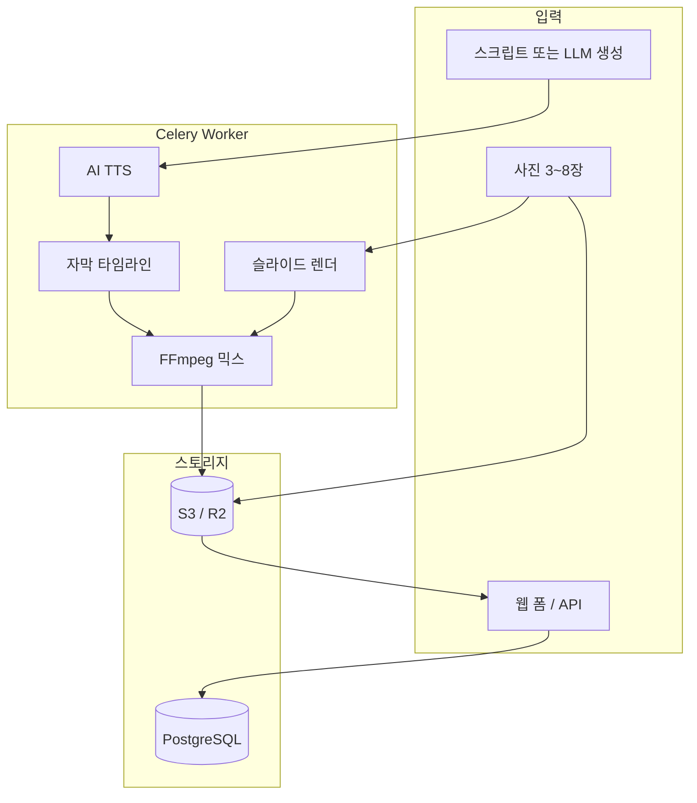

# 업체 홍보용 릴스 자동 제작기 만들기 — AI 음성·BGM·자막·사진 전환까지 2026 완전 가이드

카페, 미용실, 학원, 인테리어 업체… 공통점이 하나 있습니다.

> **인스타 사진은 많은데, 릴스를 매주 못 올린다.**

편집 앱으로 30초 영상 하나 만드는 데 1~2시간이 걸리고, 나레이션 녹음·자막·BGM 밸런스는 더 번거롭습니다. 그래서 **“사진 5장 + 홍보 문구만 넣으면 릴스가 나오는 자동 제작기”** 는 로컬 비즈니스·마케팅 대행·1인 SaaS 모두에게 실용적인 제품입니다.

이 글은 다음을 한 파이프라인으로 묶는 방법을 다룹니다.

- **AI 음성(TTS)** 나레이션
- **잔잔한 배경음악(BGM)** — 음성보다 작게, 덕킹(ducking) 적용
- **자막** — 읽기 쉬운 위치·크기·타이밍
- **사진 자동 전환** — Ken Burns(줌·팬), 크로스페이드

> TTS 인프라 설계는 [Django Ninja STT/TTS 가이드](/2026/01/27-django-ninja-stt-tts-production/)를, 인스타 마케팅 맥락은 [인스타 마케팅 가이드](/2026/03/22-instagram-marketing-beginner-guide/)와 함께 보면 좋습니다.

---

## 0. 결론부터: 릴스 자동 제작 파이프라인 5단계

```
[입력] 업체명·문구·사진 3~8장
  → ① 스크립트 생성(또는 직접 입력)
  → ② AI 음성(TTS) MP3
  → ③ 자막 타임라인(SRT/ASS)
  → ④ 사진 슬라이드 영상(무음)
  → ⑤ 음성 + BGM 믹스 + 자막 번인
  → [출력] 1080×1920 MP4 (9:16)
```

| 단계 | 실패 신호 | 핵심 |
|---|---|---|
| **스크립트** | 90초 넘는 장문 | 15~45초, 문장 5~7개 |
| **TTS** | 로봇 같은 억양 | 속도·쉼·브랜드 톤 |
| **자막** | 한 화면에 3줄 이상 | 2줄 이내, 키워드 강조 |
| **사진** | 해상도 깨짐·비율 깨짐 | 9:16 크롭·Ken Burns |
| **믹스** | BGM이 음성 가림 | -18~-24 LUFS BGM, 덕킹 |

---

## 1. 왜 “릴스 자동 제작기”인가

### 1.1 릴스가 로컬 비즈니스에 맞는 이유

[인스타 마케팅 가이드](/2026/03/22-instagram-marketing-beginner-guide/)에서 정리했듯, **릴스는 인스타가 가장 밀어주는 형식**입니다. 업체 홍보용 숏폼은 다음 조건을 만족할 때 성과가 납니다.

| 요소 | 자동화 적합도 |
|---|---|
| 짧은 길이 (15~60초) | 높음 |
| 반복 템플릿 (오픈·메뉴·후기) | 높음 |
| 사진 위주 콘텐츠 | 높음 |
| 복잡한 스토리텔링 | 낮음 |

**자동화에 잘 맞는 업종**: 카페·베이커리, 미용·네일, 피트니스, 학원·과외, 인테리어·시공, 펜션·숙소.

### 1.2 제품 형태 3가지

| 형태 | 고객 | 수익 |
|---|---|---|
| **내부 툴** | 본인 대행사 | 인건비 절감 |
| **B2B SaaS** | 소상공인 월 구독 | MRR |
| **API** | 마케팅 툴·IM웹·예약 시스템 | 건당·API 호출 |

[1인 구독 SaaS 전략](/2026/06/01/ai-solo-founder-subscription-global-strategy/) 관점에서 **“월 9,900원에 주 4개 릴스”** 는 설명이 쉬운 플랜입니다.

---

## 2. 시스템 아키텍처

### 2.1 전체 구조



- **동기 HTTP로 영상 렌더 금지** — 30초~수 분 소요. [Celery Beat](/2026/03/24-django-ninja-celery-beat-complete-guide/)로 비동기 처리.
- 중간 산출물(음성·무음 영상)은 **S3/R2**에 저장 ([Presigned URL 가이드](/2025/09-27-django-ninja-aws-s3-presigned-url-guide/) 참고).

### 2.2 기술 스택 추천

```python
{
    "API": "Django Ninja",
    "Queue": "Celery + Redis",
    "Video": "FFmpeg (프로덕션) / MoviePy (프로토타입)",
    "Image": "Pillow",
    "TTS": "OpenAI TTS / ElevenLabs / Naver Clova",
    "Subtitle": "pysubs2 / FFmpeg subtitles filter",
    "Storage": "S3 또는 Cloudflare R2",
    "Optional LLM": "스크립트 초안 생성",
}
```

**프로토타입**은 MoviePy로 빠르게, **프로덕션**은 FFmpeg로 통일하는 팀이 많습니다. FFmpeg가 메모리·속도·자막 번인에서 유리합니다.

### 2.3 출력 스펙 (인스타 릴스)

| 항목 | 권장값 |
|---|---|
| 해상도 | **1080 × 1920** (9:16) |
| 프레임 | 30 fps |
| 길이 | 15~60초 (업체 홍보는 **20~35초** sweet spot) |
| 코덱 | H.264 + AAC |
| 파일 크기 | 50MB 이하 (업로드 안정) |

---

## 3. 입력 설계 — 무엇을 받을 것인가

### 3.1 최소 입력 스키마

```python
from ninja import Schema
from typing import List, Optional

class ReelsJobIn(Schema):
    business_name: str
    tagline: str                    # 한 줄 슬로건
    bullets: List[str]              # 핵심 포인트 3~5개
    cta: str = "지금 예약하세요"     # 마지막 행동 유도
    photo_urls: List[str]           # 3~8장
    voice: str = "nova"             # TTS 보이스 ID
    bgm_track: str = "calm-01"      # 라이브러리 키
    template: str = "clean"         # clean | bold | luxury
```

### 3.2 스크립트 자동 생성 (선택)

LLM으로 `bullets`를 **말하듯 자연스러운 5~7문장**으로 변환합니다.

```python
PROMPT = """
당신은 로컬 비즈니스 인스타 릴스 카피라이터입니다.
조건:
- 전체 낭독 시간 25~35초 (한국어 약 80~120자)
- 문장은 짧고 구어체
- 마지막 문장은 CTA
- 이모지·해시태그 금지 (TTS용)
입력: {business_name}, {tagline}, {bullets}
"""
```

**팁**: 스크립트에 **쉼표·마침표**를 넣으면 TTS 억양이 자연스러워집니다.

### 3.3 사진 가이드 (업체에 안내할 체크리스트)

- 가로·세로 혼합 가능 — **서버에서 9:16 중앙 크롭**
- 최소 **1080px 긴 변** 이상
- 텍스트·워터마크 과다 사진은 피하기
- 인물 사진은 **얼굴이 중앙**에 오게

---

## 4. AI 음성(TTS) — 나레이션 만들기

### 4.1 TTS 엔진 선택

| 엔진 | 장점 | 단점 |
|---|---|---|
| **OpenAI TTS** | 품질·속도·API 단순 | 비용(문자당) |
| **ElevenLabs** | 감정·브랜드 보이스 클론 | 가격·약관 |
| **Naver Clova** | 한국어 자연스러움 | SSML 학습 |
| **Amazon Polly** | 안정·저렴 | 톤 선택 제한 |

[STT/TTS 프로덕션 가이드](/2026/01/27-django-ninja-stt-tts-production/)의 Polly·OpenAI 예시를 그대로 확장할 수 있습니다.

### 4.2 OpenAI TTS 예시

```python
# services/tts.py
import httpx
from pathlib import Path

async def synthesize_narration(text: str, out_path: Path, voice: str = "nova") -> Path:
    async with httpx.AsyncClient(timeout=60) as client:
        resp = await client.post(
            "https://api.openai.com/v1/audio/speech",
            headers={"Authorization": f"Bearer {OPENAI_API_KEY}"},
            json={
                "model": "gpt-4o-mini-tts",
                "voice": voice,
                "input": text,
                "response_format": "mp3",
                "speed": 1.05,  # 릴스는 약간 빠르게
            },
        )
        resp.raise_for_status()
        out_path.write_bytes(resp.content)
    return out_path
```

### 4.3 음성 톤 가이드 (업종별)

| 업종 | voice | speed | 느낌 |
|---|---|---|---|
| 카페·베이커리 | soft female | 1.0 | 따뜻함 |
| 피트니스 | energetic | 1.1 | 에너지 |
| 법률·세무 | neutral male | 0.95 | 신뢰 |
| 뷰티 | warm female | 1.05 | 친근 |

---

## 5. 자막 — 읽히게 만드는 법

### 5.1 릴스 자막 원칙

1. **한 화면 최대 2줄** (세로 화면 기준 12~16자 × 2줄)
2. **하단 20~25%** — UI(좋아요·댓글)와 겹치지 않게
3. **키워드 bold·색상** (ASS 스타일로 처리)
4. **음성과 0.1~0.2초 선행** — 인지 부하 감소

### 5.2 문장 단위 SRT 생성 (MVP)

정확한 단어 단위 싱크가 필요하면 Whisper 타임스탬프를 쓰고, MVP는 **문장 균등 분할**로 시작합니다.

```python
# services/subtitles.py
from pathlib import Path

def script_to_srt(sentences: list[str], total_duration: float, out_path: Path) -> Path:
    n = len(sentences)
    slot = total_duration / n
    lines = []
    for i, sent in enumerate(sentences):
        start = i * slot
        end = (i + 1) * slot - 0.05
        lines.append(f"{i+1}")
        lines.append(f"{_fmt(start)} --> {_fmt(end)}")
        lines.append(sent.strip())
        lines.append("")
    out_path.write_text("\n".join(lines), encoding="utf-8")
    return out_path

def _fmt(sec: float) -> str:
    h = int(sec // 3600)
    m = int((sec % 3600) // 60)
    s = int(sec % 60)
    ms = int((sec - int(sec)) * 1000)
    return f"{h:02d}:{m:02d}:{s:02d},{ms:03d}"
```

### 5.3 ASS로 “릴스 스타일” 자막

SRT보다 **ASS(Advanced SubStation Alpha)** 가 테두리·폰트·위치 제어에 유리합니다.

```ini
[V4+ Styles]
Format: Name, Fontname, Fontsize, PrimaryColour, OutlineColour, Bold, Alignment, MarginV
Style: Reels,Noto Sans CJK KR Bold,52,&H00FFFFFF,&H00000000,-1,2,120

[Events]
Format: Layer, Start, End, Style, Text
Dialogue: 0,0:00:00.00,0:00:03.50,Reels,{\an2}성수동에서 찾은 작은 카페
```

- `Alignment=2`: 하단 중앙  
- `MarginV=120`: 하단 여백  
- `Outline`: 배경이 밝아도 가독성 확보

---

## 6. 사진 자동 전환 — 슬라이드 + Ken Burns

### 6.1 타이밍 규칙

```
총 길이 = 나레이션 길이 (또는 나레이션 + 0.5초 여유)
사진 1장당 시간 = 총 길이 / 사진 수
전환 = 0.4~0.6초 crossfade
```

예: 나레이션 28초, 사진 7장 → 장당 4초, crossfade 0.5초.

### 6.2 FFmpeg로 Ken Burns + 크로스페이드

각 사진을 **살짝 줌인**하면 정적 슬라이드가 “영상 같아” 보입니다.

```bash
# 단일 이미지 → 4초 클립 (1080x1920, 줌인)
ffmpeg -loop 1 -i photo.jpg -t 4 \
  -vf "scale=1080:1920:force_original_aspect_ratio=increase,crop=1080:1920,\
       zoompan=z='min(zoom+0.0015,1.15)':d=120:s=1080x1920:fps=30" \
  -pix_fmt yuv420p clip_01.mp4
```

여러 클립을 **xfade**로 이어붙입니다.

```bash
ffmpeg -i clip_01.mp4 -i clip_02.mp4 \
  -filter_complex "[0:v][1:v]xfade=transition=fade:duration=0.5:offset=3.5[v]" \
  -map "[v]" -an slideshow.mp4
```

### 6.3 Python에서 일괄 생성

```python
# services/slideshow.py
import subprocess
from pathlib import Path

def render_slideshow(images: list[Path], duration_per: float, out: Path) -> Path:
    clips = []
    for idx, img in enumerate(images):
        clip = out.parent / f"clip_{idx:02d}.mp4"
        frames = int(duration_per * 30)
        vf = (
            f"scale=1080:1920:force_original_aspect_ratio=increase,crop=1080:1920,"
            f"zoompan=z='min(zoom+0.0012,1.12)':d={frames}:s=1080x1920:fps=30"
        )
        subprocess.run([
            "ffmpeg", "-y", "-loop", "1", "-i", str(img),
            "-t", str(duration_per), "-vf", vf,
            "-pix_fmt", "yuv420p", str(clip),
        ], check=True)
        clips.append(clip)

    # 2장 이상이면 xfade 체인 (MVP는 concat demuxer로 단순화 가능)
    _concat_with_xfade(clips, out, fade=0.5)
    return out
```

**템플릿별 차이**:

| template | 전환 | Ken Burns |
|---|---|---|
| clean | fade | 약한 줌 (1.08) |
| bold | wipeleft | 강한 줌 (1.18) |
| luxury | fadeblack | 느린 줌 (1.05) |

---

## 7. BGM — 잔잔하게, 음성은 또렷하게

### 7.1 믹싱 원칙

| 트랙 | 목표 |
|---|---|
| **나레이션** | -16 ~ -14 LUFS, 중심 |
| **BGM** | -24 ~ -18 LUFS, 음성 대비 **-12~-18 dB** |

“잔잔히 깔린다”는 **BGM이 존재감은 있되 가사·음성을 방해하지 않는 상태**입니다. 업체 홍보 릴스에는 **보컬 없는 로파이·어쿠스틱·앰비언트**가 안전합니다.

### 7.2 BGM 라이브러리 운영

- **저작권 클리어** 트랙만 (Artlist, Epidemic, 직접 제작 루프)
- 업종별 5~10곡 **프리셋**
- 루프 포인트 맞춘 **30~60초 편집본** 미리 준비

### 7.3 FFmpeg 믹스 + 덕킹

```bash
# voice.mp3 + bgm.mp3 → final_audio.mp3
ffmpeg -i voice.mp3 -i bgm.mp3 \
  -filter_complex "
    [1:a]volume=0.18,afade=t=in:st=0:d=1,afade=t=out:st=27:d=2[bgm];
    [0:a][bgm]amix=inputs=2:duration=first:dropout_transition=2,
    loudnorm=I=-16:TP=-1.5:LRA=11[aout]
  " -map "[aout]" final_audio.mp3
```

**덕킹(고급)**: 음성 구간에서 BGM을 자동으로 더 낮춥니다.

```bash
# sidechaincompress — 음성이 나올 때 BGM 레벨 하락
ffmpeg -i voice.mp3 -i bgm.mp3 \
  -filter_complex "[1:a][0:a]sidechaincompress=threshold=0.02:ratio=6:attack=50:release=400[bgmduck];[0:a][bgmduck]amix=inputs=2:duration=first" \
  final_audio.mp3
```

---

## 8. 최종 합성 — 영상 + 음성 + 자막

```bash
ffmpeg -i slideshow.mp4 -i final_audio.mp3 \
  -vf "subtitles=subs.ass:fontsdir=./fonts" \
  -c:v libx264 -preset medium -crf 22 \
  -c:a aac -b:a 128k -shortest \
  -movflags +faststart \
  output_reels.mp4
```

- `shortest`: 영상·음성 길이 맞춤  
- `faststart`: 모바일 스트리밍·업로드 최적화  
- 폰트는 **Noto Sans KR** 등 상업 이용 가능 폰트 번들

### 8.1 Celery 작업으로 묶기

```python
# tasks/reels.py
from celery import shared_task
from pathlib import Path

@shared_task(bind=True, max_retries=2)
def render_reels_job(self, job_id: str):
    job = ReelsJob.objects.get(pk=job_id)
    work = Path(f"/tmp/reels/{job_id}")
    work.mkdir(parents=True, exist_ok=True)

    script = job.script_text
    voice_path = synthesize_narration_sync(script, work / "voice.mp3", job.voice)
    duration = get_audio_duration(voice_path)

    srt = script_to_srt(split_sentences(script), duration, work / "subs.srt")
    ass = srt_to_ass(srt, template=job.template, work / "subs.ass")

    images = download_images(job.photo_urls, work / "img")
    slideshow = render_slideshow(images, duration / len(images), work / "slideshow.mp4")

    bgm = pick_bgm(job.bgm_track)
    final_audio = mix_audio(voice_path, bgm, duration, work / "final_audio.mp3")

    output = work / "output.mp4"
    burn_subtitles_and_mux(slideshow, final_audio, ass, output)

    url = upload_to_r2(output, key=f"reels/{job_id}.mp4")
    job.status = "done"
    job.output_url = url
    job.save()
    return url
```

---

## 9. Django Ninja API — 클라이언트 인터페이스

```python
# api/reels.py
from ninja import Router
from tasks.reels import render_reels_job

router = Router()

@router.post("/jobs", response=ReelsJobOut)
def create_job(request, payload: ReelsJobIn):
    script = payload.script or generate_script(payload)
    job = ReelsJob.objects.create(
        business_name=payload.business_name,
        script_text=script,
        photo_urls=payload.photo_urls,
        voice=payload.voice,
        bgm_track=payload.bgm_track,
        template=payload.template,
        status="queued",
    )
    render_reels_job.delay(str(job.id))
    return {"id": job.id, "status": job.status}

@router.get("/jobs/{job_id}", response=ReelsJobOut)
def get_job(request, job_id: str):
    job = ReelsJob.objects.get(pk=job_id)
    return job
```

프론트(Next.js)는 **폴링 또는 SSE**로 `status`를 확인하고, `done`이면 미리보기·다운로드 링크를 표시합니다.

---

## 10. UI/UX — 업체가 쓰기 쉽게

### 10.1 3단계 마법사

1. **정보** — 상호, 한 줄 소개, 연락처·위치  
2. **사진** — 드래그 정렬, 대표 사진 표시  
3. **스타일** — 보이스, BGM, 템플릿 미리듣기·미리보기

### 10.2 미리보기 전략

- 전체 렌더 전 **3초 저해상도 프리뷰** (워터마크)  
- 유료 플랜에서 워터마크 제거·1080p

### 10.3 인스타 업로드 연동 (선택)

[Instagram API 가이드](/2026/03/10-django-ninja-instagram-api-integration-guide/)로 **Graph API 컨테이너 업로드**까지 연결하면 “제작→게시” 원스톱이 됩니다. 다만 앱 심사·비즈니스 계정 요건이 있으므로 MVP 이후 단계로 권장합니다.

---

## 11. 품질·비용·속도 튜닝

### 11.1 렌더 시간 목표

| 환경 | 30초 릴스 목표 |
|---|---|
| 로컬 M1/M2 | 20~40초 |
| 2 vCPU VPS | 1~3분 |
| GPU (NVENC) | 10~20초 |

`libx264 -preset veryfast`는 MVP, 프로덕션은 `medium` + 큐 워커 스케일아웃.

### 11.2 비용 대략 (건당)

| 항목 | 30초 1건 |
|---|---|
| OpenAI TTS (~100자) | ₩50~150 |
| 스토리지·전송 | ₩10~30 |
| 컴pute (VPS 분) | ₩20~80 |
| **합계** | **₩100~300** |

월 29,000원에 주 8건이면 건당 ₩900 미만 — **마진 설계 가능**.

### 11.3 흔한 품질 이슈

| 증상 | 원인 | 해결 |
|---|---|---|
| 자막 잘림 | 세이프존 무시 | MarginV↑ |
| 사진 흐림 | 업스케일 과다 | 원본 해상도 안내 |
| 음성 끊김 | MP3 비트레이트 낮음 | 128kbps+ |
| BGM 갑자기 끊김 | 루프 미처리 | afade out + 루프 편집 |

---

## 12. 비즈니스·운영 체크리스트

### 12.1 법무·저작권

- [ ] BGM 라이선스 문서 보관  
- [ ] 업체 제공 사진 **사용 권한** 동의  
- [ ] AI 생성 음성·문구 **이용약관** 명시  
- [ ] 허위·과장 광고 문구 필터 (의료·금융 등)

### 12.2 출시 전 기술 체크

- [ ] 9:16 1080p 일관 출력  
- [ ] 한글 자막 iOS·Android 인스타 앱에서 가독성 확인  
- [ ] 50MB 이하  
- [ ] 실패 작업 재시도·알림  
- [ ] PII 로그 마스킹

### 12.3 90일 로드맵

| 기간 | 목표 |
|---|---|
| **1~2주** | CLI로 사진+문구→MP4 1파이프라인 |
| **3~5주** | Django API + Celery + S3 |
| **6~8주** | 웹 UI + 템플릿 3종 + 결제 |
| **9~12주** | 대행사·프랜차이즈 파일럿 3곳 |

---

## 13. 확장 아이디어

| 기능 | 가치 |
|---|---|
| **가게마다 보이스·색상 브랜딩** | 리텐션 |
| **리뷰 텍스트 → 릴스** | UGC 활용 |
| **예약 시스템·IM웹 웹훅** | 신규 메뉴 자동 릴스 |
| **A/B 썸네일·첫 3초** | 전환율 |
| **유튜브 Shorts·틱톡 동시 출력** | 멀티 채널 |

[AI Report 직원](/2026/05/30/ai-report-employee-daily-briefing-automation/)으로 **주간 인스타 인사이트 + 다음 릴스 주제**를 브리핑하면 운영도 자동화할 수 있습니다.

---

## 14. 정리

업체 홍보용 릴스 자동 제작기의 본질은 **“편집 실력”을 “파이프라인”으로 바꾸는 것**입니다.

> **짧은 스크립트 → AI 음성 → 사진 Ken Burns → 잔잔한 BGM 덕킹 → 릴스형 자막 → 9:16 MP4**

1. **FFmpeg 중심**으로 프로덕션 품질을 확보하고  
2. **Celery**로 렌더를 비동기화하며  
3. **템플릿·BGM·보이스 프리셋**으로 업종별 차별화하고  
4. **월 구독 SaaS** 또는 **대행사 내부 툴**로 수익화한다  

오늘 당장은 서버 없이 **로컬 Python 스크립트 하나**로 사진 5장과 홍보 문구만 넣어 30초 MP4를 뽑아보세요. 그 한 파일이 전체 제품의 코어입니다.

---

## 참고 자료

- [FFmpeg 공식 문서](https://ffmpeg.org/documentation.html)
- [OpenAI Audio Speech API](https://platform.openai.com/docs/guides/text-to-speech)
- [Instagram Reels 스펙 (Meta)](https://developers.facebook.com/docs/instagram-api)
- [MoviePy 문서](https://zulko.github.io/moviepy/) — 프로토타입용

---

## 관련 글

- [Django Ninja STT/TTS 프로덕션](/2026/01-27-django-ninja-stt-tts-production/)
- [인스타그램 마케팅 완벽 가이드](/2026/03/22-instagram-marketing-beginner-guide/)
- [Django Ninja Instagram API 연동](/2026/03/10-django-ninja-instagram-api-integration-guide/)
- [Django Ninja + Celery Beat](/2026/03/24/django-ninja-celery-beat-complete-guide/)
- [AI로 1인 구독 서비스](/2026/06-01/ai-solo-founder-subscription-global-strategy/)
- [AI Report 직원 — 일일 브리핑](/2026/05/30/ai-report-employee-daily-briefing-automation/)
- [S3 Presigned URL 가이드](/2025/09-27-django-ninja-aws-s3-presigned-url-guide/)
