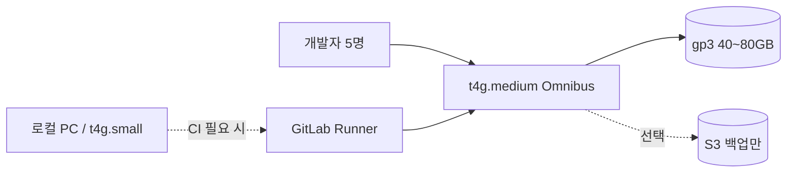
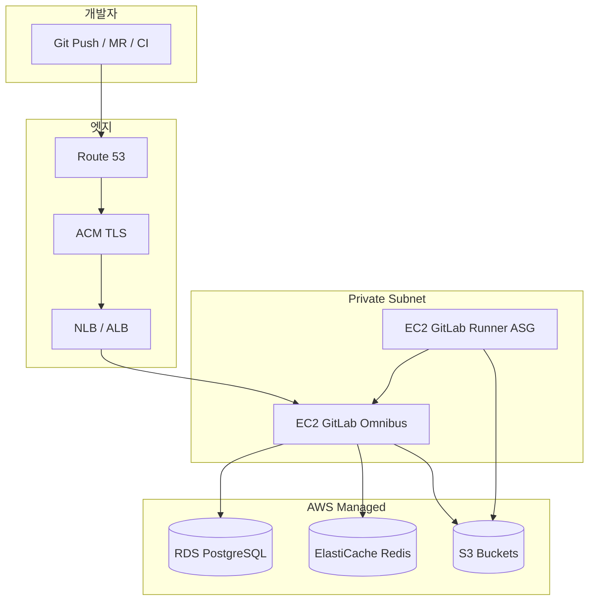

# AWS에 가장 효율적인 GitLab CE 구성하기 — 비용·성능·HA까지 2026 실전 가이드

팀이 커지면 GitHub 유료 플랜·Runner 분·프라이빗 레지스트리 비용이 빠르게 늘어납니다. **GitLab Community Edition(CE)** 은 셀프호스트 시 **코어 DevOps 기능을 라이선스 비용 없이** 쓸 수 있어, AWS에 올려두면 “우리만의 CI/CD 허브”가 됩니다.

다만 **효율적**이라는 말은 “가장 싼 EC2”가 아닙니다.

> **앱은 EC2, 상태는 RDS·ElastiCache·S3, CI는 Runner 분리, 백업은 자동화**

[GitLab 공식 문서](https://docs.gitlab.com/administration/reference_architectures/)도 동일한 방향을 권장합니다. 번들 PostgreSQL·Redis 대신 **Amazon RDS·ElastiCache·S3**를 쓰고, 1,000명 이하라면 **단일 EC2 + 스냅샷 전략**으로 시작할 수 있습니다.

이 글은 **5명 소규모 팀이 `t4g.medium`에서 겨우 돌아가는 설정**부터, 팀이 커졌을 때 **RDS·S3·Runner 분리**까지 규모별로 **가장 비용 대비 성능이 좋은 GitLab CE AWS 구성**을 정리합니다.

> 컨테이너·배포 패턴은 [ECS Fargate 아키텍처](/2025/07/08/aws-saa-ecs-fargate-rds-web-architecture/)와 [Docker 배포 가이드](/2025/10/11-django-ninja-docker-deployment-guide/)를, IaC는 [CloudFormation/CDK](/2025/07/10/aws-saa-cloudformation-cdk-infrastructure-as-code/) 글과 함께 보면 좋습니다.

---

## 0. 결론부터: 규모별 “가장 효율적인” 선택

| 팀 규모 | 권장 구성 | HA | 월 비용 감각 (서울 리전) |
|---|---|---|---|
| **~5명, 비용 최우선** | **`t4g.medium` Omnibus 올인원** + 메모리 튜닝 | ✗ | **$30~45** |
| **~30명, CI 가벼움** | EC2 1대 (Omnibus) + EBS 스냅샷 | ✗ | $80~150 |
| **~100명, 프로덕션 CI** | EC2 + **RDS** + **ElastiCache** + **S3** | ✗ | $250~450 |
| **~300명, 24/7** | EC2 ASG(2) + RDS Multi-AZ + S3 + NLB | △ (앱만) | $600~1,000 |
| **1,000명+ / HA 필수** | [Reference Architecture](https://docs.gitlab.com/administration/reference_architectures/) + **GET** | ✓ | $2,000+ |

**5명 이하 팀**은 첫 번째 줄(올인원 + 튜닝)로 시작해도 충분합니다. **~100명**이 sweet spot인 **RDS·ElastiCache·S3 분리**는 메모리·운영 여유가 생긴 뒤 단계적으로 적용하세요.

---

## 1. 소규모 팀 실전 — 5명·`t4g.medium`으로 GitLab 운영하기

실제 5명 규모 팀이 AWS **`t4g.medium`(2 vCPU, 4 GiB RAM, Graviton)** 에 GitLab CE Omnibus를 올려 운영 중인 사례를 기준으로, **겨우 돌아가는 선에서 안정화하는 방법**을 정리합니다.

> GitLab 공식 [메모리 제약 환경 가이드](https://docs.gitlab.com/omnibus/settings/memory_constrained_envs/)도 **4GB 미만·소규모 팀**을 전제로 `puma['worker_processes'] = 0` 등을 권장합니다. 다만 커뮤니티에서는 **체감 속도를 위해 8GB(`t4g.large`)** 를 권하는 의견도 많습니다. 4GB는 **비용 최우선·동시 접속 1~2명** 전제입니다.

### 1.1 5명 팀에 맞는 아키텍처 (미니멀)



| 항목 | 5명 팀 현실적 선택 |
|---|---|
| GitLab 본체 | `t4g.medium` 1대, **Omnibus 올인원** (PG·Redis 내장) |
| RDS / ElastiCache | **당분간 생략** — RAM 4GB에 매니지드 분리까지는 부담 |
| Container Registry | **끄기** — Docker Hub·GHCR·ECR Public 사용 |
| GitLab Pages | **끄기** — Vercel·S3 정적 호스팅 |
| GitLab KAS | **끄기** — Kubernetes Agent 미사용 시 불필요 |
| 모니터링 스택 | **끄기** — CloudWatch 기본 알람만 |
| CI | **같은 EC2에 두지 말 것** — 로컬 Runner 또는 빌드 시만 `t4g.small` 기동 |

### 1.2 메모리가 어디로 가는가

Omnibus 기본 설치는 **Prometheus·Grafana·Exporter·KAS·Registry**까지 켜면 4GB에서 금방 OOM(Out Of Memory)이 납니다. 대략적인 감각은 다음과 같습니다.

| 프로세스 | 대략 RAM | 5명 팀 |
|---|---|---|
| Puma (clustered, worker 2+) | 1.5~3 GB+ | **worker 0 → 단일 프로세스** |
| Sidekiq | 500MB~1GB+ | **concurrency 5 이하** |
| PostgreSQL (내장) | 200~500 MB | 유지 (공식 최소 구성) |
| Redis (내장) | 50~200 MB | 유지 |
| Gitaly | 200~500 MB | 유지 |
| Prometheus + Exporters | 300~800 MB | **전부 끄기** |
| Registry / Pages / KAS | 각 100~300 MB | **끄기** |

### 1.3 실전 `gitlab.rb` — 메모리 절약 (5명 팀 적용 예)

아래는 **실제 5명 팀이 적용해 동작을 확인한 설정**입니다. [공식 메모리 제약 가이드](https://docs.gitlab.com/omnibus/settings/memory_constrained_envs/)와 함께 보세요.

```ruby
# /etc/gitlab/gitlab.rb — 소규모·메모리 제약 (t4g.medium)

# --- Puma: 클러스터 모드 해제 (단일 프로세스) ---
# worker_processes = 0 은 공식 권장. 100~400MB 절감, 동시 처리량은 감소.
puma['worker_processes'] = 0
puma['min_threads'] = 1
puma['max_threads'] = 2

# --- Sidekiq: 백그라운드 job 동시성 축소 ---
# 키는 max_concurrency 가 표준. 구버전/별칭으로 concurrency 도 쓰이는 경우 있음.
sidekiq['max_concurrency'] = 5

# --- 내장 모니터링 전부 끄기 (CloudWatch로 대체) ---
prometheus_monitoring['enable'] = false
prometheus['enable'] = false
grafana['enable'] = false
alertmanager['enable'] = false
node_exporter['enable'] = false
redis_exporter['enable'] = false
postgres_exporter['enable'] = false
gitlab_exporter['enable'] = false

# --- 5명 팀에 불필요한 부가 기능 ---
gitlab_kas['enable'] = false          # Kubernetes Agent
gitlab_pages['enable'] = false        # 정적 사이트 호스팅
registry['enable'] = false            # Container Registry
gitlab_rails['registry_enabled'] = false

# --- jemalloc: 메모리 반환 촉진 (공식 권장) ---
gitlab_rails['env'] = {
  'MALLOC_CONF' => 'dirty_decay_ms:1000,muzzy_decay_ms:1000'
}
```

적용:

```bash
sudo gitlab-ctl reconfigure
sudo gitlab-ctl restart
sudo gitlab-rake gitlab:check SANITIZE=true
```

**`puma['worker_processes'] = 0`이란?**  
Puma **클러스터 모드를 끄고** 워커 프로세스 1개만 쓰는 설정입니다. “워커 0개”가 아니라 **단일 Puma**로 동작합니다. MR·push가 겹치면 응답이 잠깐 느려질 수 있지만, 5명 규모에서는 허용 가능한 트레이드오프입니다.

### 1.4 EC2·디스크·스왑 — 4GB에서 OOM 막기

| 항목 | 권장 |
|---|---|
| **EBS** | gp3 **40GB 이상**, IOPS **최소 3000** (스왑 시 디스크 병목 방지) |
| **스왑** | **2GB** 파일 스왑 추가 (OOM 킬 방지용 안전망) |
| **인스턴스 크레딧** | `t4g`는 버스트형 — CI를 같은 인스턴스에서 돌리면 CPU 크레딧 고갈 |

```bash
# 스왑 2GB (재부팅 후에도 유지하려면 /etc/fstab 등록)
sudo fallocate -l 2G /swapfile
sudo chmod 600 /swapfile
sudo mkswap /swapfile
sudo swapon /swapfile
echo '/swapfile none swap sw 0 0' | sudo tee -a /etc/fstab

# swappiness 낮추기 — RAM 우선, 스왑은 비상용
echo 'vm.swappiness=10' | sudo tee /etc/sysctl.d/99-gitlab-swappiness.conf
sudo sysctl -p /etc/sysctl.d/99-gitlab-swappiness.conf
```

메모리 확인 루틴:

```bash
free -h
sudo gitlab-ctl status
ps aux --sort=-%mem | head -15
```

### 1.5 소규모 팀 운영 원칙

**기능**

| 원칙 | 이유 |
|---|---|
| MR·코드 리뷰·이슈만 GitLab | 핵심 가치 |
| Docker 이미지는 **외부 레지스트리** | Registry RAM·디스크 절약 |
| 정적 문서·블로그는 **별도 호스팅** | Pages 비활성 |
| LFS는 **당분간 자제** 또는 S3 연동 후 소량만 | 디스크·RAM |

**CI/CD**

```yaml
# .gitlab-ci.yml — 5명 팀: 가벼운 job만 같은 망에서
default:
  interruptible: true
  timeout: 15m

variables:
  ARTIFACT_EXPIRATION: "3 days"

test:
  stage: test
  script: pytest -q
  rules:
    - if: $CI_PIPELINE_SOURCE == "merge_request_event"
  tags: [local-runner]   # 개발 PC 또는 별도 소형 EC2
```

- **무거운 Docker build**는 GitLab EC2에서 실행하지 않기  
- `interruptible: true` — 새 push 시 이전 파이프라인 취소  
- 아티팩트 **3~7일** 만료 (`Admin → Settings → CI/CD`)

**업그레이드·백업**

- GitLab **마이너 업그레이드** 전 반드시 `gitlab-backup create`  
- 백업만큼은 **S3 1버킷**(`gl-backups-*`) 연결 권장 — 월 $1 미만으로 DR 확보  
- 업그레이드 직후 1~2일은 메모리 사용량 증가 사례 있음 → `htop` 관찰

### 1.6 소규모 최적화 추가 체크리스트

```ruby
# 추가로 검토할 gitlab.rb (상황에 따라)

# 로그 레벨·보관 축소
logging['log_level'] = 'warn'

# 내장 PostgreSQL (올인원일 때)
postgresql['shared_buffers'] = '128MB'
postgresql['max_connections'] = 100

# 내장 Redis
redis['maxmemory'] = '128mb'
redis['maxmemory_policy'] = 'allkeys-lru'

# 아티팩트 로컬 디스크 압박 시 — 여유 생기면 S3로 이전
# gitlab_rails['artifacts_enabled'] = true
# gitlab_rails['object_store']['enabled'] = true
```

**관측 (Prometheus 대신)**

| 신호 | 도구 |
|---|---|
| EC2 메모리·CPU | **CloudWatch** `mem_used_percent`, `CPUUtilization` |
| 디스크 | `disk_used_percent` > 80% 알람 |
| GitLab 살아있음 | 외부 **UptimeRobot** / Route 53 Health Check |
| Sidekiq 적체 | 주 1회 `sudo gitlab-rails runner "puts Sidekiq::Queue.all.map(&:size)"` |

### 1.7 언제 스펙을 올릴까 — 신호등

| 신호 | 조치 |
|---|---|
| 주 1회 이상 OOM·`gitlab-ctl` 재시작 | **`t4g.large`(8GB)** 또는 튜닝 재검토 |
| MR 중 UI 10초+ 로딩이 일상 | `puma max_threads` 2→4, 또는 스펙 업 |
| Sidekiq queue가 계속 쌓임 | `max_concurrency` 5→8 + 스펙 업 |
| CI를 GitLab에 붙이고 싶다 | **Runner 전용 `t4g.small`** 분리 |
| 팀 10명+·repo 50GB+ | **S3 아티팩트** + `m7g.large` 검토 |
| 24/7 SLA 필요 | RDS 분리·Multi-AZ — 이 글 3장 이후 구성 |

### 1.8 5명 팀 월 비용 (서울)

| 리소스 | 스펙 | 월 (USD) |
|---|---|---|
| EC2 | `t4g.medium` on-demand | ~27 |
| EBS | gp3 50GB | ~5 |
| Elastic IP | 1개 (인스턴스에 연결 시 무료) | 0 |
| S3 백업 | 10GB | ~1 |
| **합계** | | **~33** |

1년 **Reserved**·**Savings Plan**이면 ~20% 추가 절감. **HA·RDS 없이** 월 $35 안팎이 5명 팀 GitLab의 현실적인 바닥선입니다.

---

## 2. 왜 AWS + GitLab CE인가

### 2.1 CE로 가능한 것 (2026 기준 핵심)

| 기능 | CE |
|---|---|
| Git 저장소·MR·코드 리뷰 | ✓ |
| CI/CD (`.gitlab-ci.yml`) | ✓ |
| Container Registry | ✓ |
| 이슈·보드 (기본) | ✓ |
| 보안 스캔 일부 | 제한 (Ultimate 기능은 유료) |

소규모·중소 팀의 **빌드·배포·레지스트리**에는 CE만으로 충분한 경우가 많습니다.

### 2.2 AWS를 쓰는 이유

| 이점 | 설명 |
|---|---|
| **RDS/ElastiCache** | DB·Redis 패치·백업 자동화 |
| **S3** | 아티팩트·LFS·백업 — GB당 저렴 |
| **IAM Role** | EC2에 키 없이 S3 접근 |
| **ASG + Runner** | CI 부하만 탄력 확장 |
| **서울 리전** | 국내 팀 지연 시간 |

---

## 3. 효율적인 아키텍처 한 장

> **5명·t4g.medium** 팀은 [1장 소규모 실전](#1-소규모-팀-실전--5명t4gmedium으로-gitlab-운영하기) 구성을 먼저 보세요. 이 장부터는 **팀이 커지거나 RDS·S3 분리**를 검토할 때의 설계입니다.

### 3.1 권장 구성 (100명 내외 팀)



### 3.2 GitLab 컴포넌트 ↔ AWS 서비스 매핑

| GitLab 역할 | 비효율 (올인원 디스크) | **효율 (권장)** |
|---|---|---|
| PostgreSQL | Omnibus 내장 DB | **RDS PostgreSQL** |
| Redis | Omnibus 내장 | **ElastiCache Redis** |
| 아티팩트·LFS·업로드 | 로컬 디스크 | **S3** |
| Container Registry | 로컬 디스크 | **S3 (registry backend)** |
| 백업 | 수동 tarball | **S3 + RDS 스냅샷** |
| CI 실행 | GitLab EC2에서 빌드 | **별도 Runner EC2/ASG** |

공식 AWS 솔루션 가이드도 동일하게 **RDS + ElastiCache + S3 + ELB** 조합을 검증했습니다. ([Provision GitLab on AWS](https://docs.gitlab.com/solutions/cloud/aws/gitlab_instance_on_aws/))

---

## 4. 네트워크 설계 (VPC)

### 4.1 CIDR 예시 (ap-northeast-2)

| 리소스 | AZ-a | AZ-c |
|---|---|---|
| Public `10.0.0.0/24` | NLB, NAT | NLB |
| Private App `10.0.10.0/24` | GitLab EC2 | GitLab EC2 (선택) |
| Private Runner `10.0.20.0/24` | Runner | Runner ASG |
| DB `10.0.30.0/24` | RDS | RDS standby |

- GitLab·Runner·RDS는 **Private Subnet**
- NLB만 Public (또는 ALB + ACM)
- Runner가 외부 이미지 pull 시 **NAT Gateway** 1개 (비용 주의 — [VPC 엔드포인트](https://docs.aws.amazon.com/vpc/latest/privatelink/vpc-endpoints-s3.html)로 S3/ECR 트래픽 절감)

### 4.2 보안 그룹 (최소)

```yaml
gitlab-sg:
  inbound:
    - port 443 from nlb-sg
    - port 22 from bastion-sg only
  outbound: all (또는 RDS/Redis/S3 엔드포인트만)

rds-sg:
  inbound:
    - port 5432 from gitlab-sg, runner-sg

elasticache-sg:
  inbound:
    - port 6379 from gitlab-sg
```

---

## 5. 컴퓨트 사이징 — Reference Architecture 기준

[GitLab Reference Architectures](https://docs.gitlab.com/administration/reference_architectures/)의 **1,000 users / 20 RPS** 를 소규모 프로덕션 출발점으로 씁니다.

### 5.1 EC2 (GitLab 앱 노드)

| 프로필 | 인스턴스 | vCPU | RAM | 용도 |
|---|---|---|---|---|
| **마이크로 (5명)** | `t4g.medium` | 2 | 4 GiB | **올인원 + 1장 튜닝 필수** |
| **소규모 여유** | `t4g.large` | 2 | 8 GiB | 5~15명, 튜닝 완화 |
| **스타터** | `m7i.large` | 2 | 8 GiB | ~50명, CI 적음 |
| **권장** | `m7i.xlarge` | 4 | 16 GiB | ~100~200명 |
| **CI 분리 후** | `m7i.large` | 2 | 8 GiB | 앱만 (Runner 별도) |

- 디스크: **gp3 100~200GB** (로그·잠깐의 로컬 캐시; 대용량은 S3)
- **Reserved Instance (1년)** 적용 시 컴퓨트 30~40% 절감

### 5.2 RDS PostgreSQL

| 항목 | 권장 |
|---|---|
| 엔진 | PostgreSQL **16+** (GitLab 19.x는 PG 17 권장 — [GET 3.10](https://gitlab.com/gitlab-org/gitlab-environment-toolkit) 참고) |
| 클래스 | `db.m7g.large` (2 vCPU, 8 GiB) 시작 |
| 스토리지 | gp3 100GB, autoscaling |
| Multi-AZ | 100명 미만 단일 AZ 가능 / 프로덕션은 Multi-AZ |
| 파라미터 | `max_connections` GitLab 튜닝 가이드 따름 |

> **RDS Proxy**는 GitLab 공식 **미검증**. 직접 RDS 연결 + PgBouncer(Omnibus 내장) 조합이 일반적입니다.

### 5.3 ElastiCache Redis

| 항목 | 권장 |
|---|---|
| 엔진 | Redis 7.x |
| 노드 | `cache.t4g.medium` (스타터) → `cache.m7g.large` |
| 클러스터 | 단일 노드로 시작, HA 필요 시 replication group |

### 5.4 S3 버킷 분리

| 버킷 | 용도 |
|---|---|
| `gl-artifacts-{account}` | CI 아티팩트 |
| `gl-lfs-{account}` | Git LFS |
| `gl-uploads-{account}` | 업로드 |
| `gl-registry-{account}` | Container Registry |
| `gl-backups-{account}` | `gitlab-backup` |

**수명 주기**: 아티팩트 30~90일 만료, 백업은 Glacier 전환.

---

## 6. IAM — 키 없이 S3 접근

EC2 인스턴스 프로필에 최소 권한 정책을 붙입니다. ([공식 POC 가이드](https://docs.gitlab.com/install/aws/) 동일 패턴)

```json
{
  "Version": "2012-10-17",
  "Statement": [
    {
      "Effect": "Allow",
      "Action": ["s3:PutObject", "s3:GetObject", "s3:DeleteObject"],
      "Resource": "arn:aws:s3:::gl-*/*"
    },
    {
      "Effect": "Allow",
      "Action": [
        "s3:ListBucket",
        "s3:AbortMultipartUpload",
        "s3:ListMultipartUploadParts"
      ],
      "Resource": "arn:aws:s3:::gl-*"
    }
  ]
}
```

`gitlab.rb`에는 **Access Key를 넣지 않고** `use_iam_profile true`를 사용합니다.

---

## 7. GitLab 설정 (`gitlab.rb`) — 효율 구성 핵심

> **5명·4GB** 환경은 [1.3절 소규모 `gitlab.rb`](#13-실전-gitlabrb--메모리-절약-5명-팀-적용-예)를 우선 적용하세요. 이 절은 **RDS·S3 분리 후** 중규모 구성입니다.

### 7.1 외부 DB·Redis·S3 연결

```ruby
# /etc/gitlab/gitlab.rb (발췌)

external_url 'https://gitlab.example.com'

# PostgreSQL → RDS
gitlab_rails['db_adapter'] = 'postgresql'
gitlab_rails['db_host'] = 'gitlab.xxxxx.ap-northeast-2.rds.amazonaws.com'
gitlab_rails['db_port'] = 5432
gitlab_rails['db_database'] = 'gitlabhq_production'
gitlab_rails['db_username'] = 'gitlab'
gitlab_rails['db_password'] = '{{ Secrets Manager에서 주입 }}'

# Redis → ElastiCache
gitlab_rails['redis_host'] = 'gitlab.xxxxx.cache.amazonaws.com'
gitlab_rails['redis_port'] = 6379

# Object Storage → S3 (통합 설정 예시)
gitlab_rails['object_store']['enabled'] = true
gitlab_rails['object_store']['connection'] = {
  'provider' => 'AWS',
  'region' => 'ap-northeast-2',
  'use_iam_profile' => true
}
gitlab_rails['object_store']['objects']['artifacts']['bucket'] = 'gl-artifacts-123456'
gitlab_rails['object_store']['objects']['lfs']['bucket'] = 'gl-lfs-123456'
gitlab_rails['objects']['uploads']['bucket'] = 'gl-uploads-123456'

# Container Registry
registry['enable'] = true
gitlab_rails['registry_enabled'] = true
gitlab_rails['registry_bucket'] = 'gl-registry-123456'
```

적용:

```bash
sudo gitlab-ctl reconfigure
sudo gitlab-ctl restart
```

### 7.2 내장 PostgreSQL·Redis 비활성화

RDS/ElastiCache로 옮긴 뒤에는 Omnibus 번들 서비스를 끕니다.

```ruby
postgresql['enable'] = false
redis['enable'] = false
```

이렇게 해야 **EC2 메모리를 앱·Sidekiq·Gitaly에 집중**할 수 있습니다.

### 7.3 Sidekiq·Puma 튜닝 — 규모별

| 규모 | puma | sidekiq |
|---|---|---|
| **5명 / t4g.medium** | `worker_processes = 0`, `max_threads = 2` | `max_concurrency = 5` |
| **~50명 / m7i.large** | `worker_processes = 2` | `max_concurrency = 10` |
| **~100명 / m7i.xlarge** | `worker_processes = 4` | `max_concurrency = 20` |

중규모 이상은 `htop`·CloudWatch로 조정합니다. Omnibus Prometheus를 끈 소규모 팀은 **1.6절 CloudWatch 알람**으로 대체하세요.

---

## 8. GitLab Runner — 비용 효율의 핵심

**GitLab EC2에서 CI까지 돌리면** push 한 번에 웹 UI가 느려집니다. Runner를 분리하는 것이 **가성비 최고**입니다.

### 8.1 Runner 배치 옵션

| 방식 | 비용 | 적합 |
|---|---|---|
| **개발 PC / Shell Runner** | **무료** | **5명 팀 MVP** |
| **빌드 시만 t4g.small 기동** | 저 | 주 2~3회 CI |
| **EC2 1대 (always on)** | 중 | 빌드 24시간, 팀 ~30명 |
| **ASG + Scheduled Scaling** | 중~저 | 업무시간 CI 집중 |
| **Spot 인스턴스 Runner** | **저** | 실패 재시도 가능한 빌드 |
| **Docker executor** | — | 대부분 팀 기본 |

### 8.2 Runner 등록 (Docker executor)

```bash
# Runner EC2에 설치
curl -L https://packages.gitlab.com/install/repositories/runner/gitlab-runner/script.deb.sh | sudo bash
sudo apt-get install gitlab-runner

sudo gitlab-runner register \
  --url https://gitlab.example.com \
  --token <RUNNER_TOKEN> \
  --executor docker \
  --docker-image docker:27-dind \
  --description "aws-docker-spot"
```

`/etc/gitlab-runner/config.toml`:

```toml
concurrent = 4

[[runners]]
  name = "aws-docker"
  url = "https://gitlab.example.com"
  token = "..."
  executor = "docker"
  [runners.docker]
    image = "docker:27"
    privileged = true
    volumes = ["/cache", "/var/run/docker.sock:/var/run/docker.sock"]
  [runners.cache]
    Type = "s3"
    Shared = true
    [runners.cache.s3]
      BucketName = "gl-runner-cache-123456"
      BucketLocation = "ap-northeast-2"
```

**S3 distributed cache**를 쓰면 Runner ASG 확장 시 캐시 hit률이 올라가 빌드 시간·비용이 줄어듭니다.

### 8.3 `.gitlab-ci.yml` 효율 팁

```yaml
default:
  image: python:3.12-slim
  cache:
    key: ${CI_COMMIT_REF_SLUG}
    paths:
      - .pip-cache/
  tags:
    - aws-docker

stages: [test, build, deploy]

test:
  stage: test
  script:
    - pip install -r requirements.txt -q --cache-dir .pip-cache
    - pytest -q
  rules:
    - if: $CI_PIPELINE_SOURCE == "merge_request_event"

build:
  stage: build
  script:
    - docker build -t $CI_REGISTRY_IMAGE:$CI_COMMIT_SHA .
    - docker push $CI_REGISTRY_IMAGE:$CI_COMMIT_SHA
  rules:
    - if: $CI_COMMIT_BRANCH == $CI_DEFAULT_BRANCH
```

- **MR에서만 test**, main에서만 **build/push** — Runner 분 절약
- **interruptible: true** — 새 파이프라인 시 이전 job 취소

---

## 9. 프로비저닝 방법 — 무엇을 쓸까

### 9.1 방법 비교

| 방법 | 난이도 | 효율 | 비고 |
|---|---|---|---|
| **수동 Omnibus + 콘솔** | 하 | POC | 1~2일 실습 |
| **공식 AWS POC 가이드** | 중 | 학습 | HA 아님 |
| **[GitLab Environment Toolkit (GET)](https://gitlab.com/gitlab-org/gitlab-environment-toolkit)** | 상 | **프로덕션** | Terraform + Ansible |
| **자체 Terraform 모듈** | 상 | 맞춤 | GET 포크 가능 |

1,000명 이하·**HA 불필요** → EC2 1대 + EBS 스냅샷도 공식 권장입니다.

1,000명 이상 또는 **Gitaly Cluster HA** → **GET**이 사실상 표준입니다.

### 9.2 GET 한 줄 개요

```bash
# 개념 흐름
git clone https://gitlab.com/gitlab-org/gitlab-environment-toolkit.git
cd gitlab-environment-toolkit
# terraform/environments/ 에 aws 환경 변수 정의
terraform init && terraform apply
# ansible로 gitlab.rb 배포·클러스터 구성
```

GET은 Reference Architecture 사이즈(2K, 3K, 5K users…)를 **변수로 선택**하게 되어 있어, 처음부터 과대 프로비저닝하지 않게 돕습니다.

---

## 10. 비용 최적화 체크리스트

### 10.1 즉시 적용 (효과 큼)

| 항목 | 절감 |
|---|---|
| Runner를 GitLab EC2에서 **분리** | 앱 인스턴스 다운사이징 |
| 아티팩트·LFS → **S3** + lifecycle | EBS 용량·스냅샷 비용 |
| **Graviton (m7g/r7g)** | x86 대비 10~20% |
| EC2 **1년 RI** | 온디맨드 대비 ~35% |
| Runner **Spot** | CI 컴퓨트 ~70% |
| NAT 대신 **S3/ECR VPC Endpoint** | NAT GB당 과금 절감 |

### 10.2 월 비용 대략

**5명·t4g.medium (올인원)** — [1.8절](#18-5명-팀-월-비용-서울) 참고 (~$33).

**100명 팀, Runner 분리**

| 리소스 | 스펙 | 월 (USD) |
|---|---|---|
| EC2 GitLab | m7i.xlarge on-demand | ~140 |
| RDS | db.m7g.large Single-AZ | ~120 |
| ElastiCache | cache.t4g.medium | ~50 |
| S3 + 전송 | 200GB | ~20 |
| NLB | 1개 | ~25 |
| Runner | m7i.large 8h/day Spot | ~40 |
| **합계** | | **~400** |

팀 규모·빌드 빈도에 따라 2~3배까지 변동합니다. **CloudWatch Cost Anomaly** 알람을 꼭 켜세요.

### 10.3 비효율 패턴 (피하기)

| 패턴 | 문제 |
|---|---|
| **t4g.medium에 CI·Registry·Prometheus 동시** | OOM·UI 멈춤 (5명 팀 최대 실수) |
| Omnibus 올인원 + 거대 EBS | 백업·복구 느림, 디스크 비쌈 |
| GitLab EC2에서 Docker 빌드 | UI·Git 응답 지연 |
| 아티팩트 무제한 보관 | S3 비용 선형 증가 |
| t3.micro·스왑 없이 4GB | 메모리 부족·OOM |
| 퍼블릭 RDS/Redis | 보안 사고 |

---

## 11. 백업·복구·업그레이드

### 11.1 백업 (3-2-1)

```bash
# /etc/cron.d/gitlab-backup
0 3 * * * root /opt/gitlab/bin/gitlab-backup create CRON=1
```

- `gitlab.rb`에 `gitlab_rails['backup_upload_connection']` → **S3**
- RDS **자동 스냅샷** 7~35일
- `gitlab-secrets.json` · `gitlab.rb` → **Secrets Manager** 별도 보관

### 11.2 복구 드릴

분기 1회 **스테이징 VPC**에서 restore 테스트. “백업은 있는데 복구를 안 해봤다”는 가장 비싼 실수입니다.

### 11.3 업그레이드

```bash
# 메이저 업그레이드 전
sudo gitlab-ctl stop puma sidekiq
sudo gitlab-backup create
sudo apt-get install gitlab-ce=<target-version>
sudo gitlab-ctl reconfigure
sudo gitlab-rake gitlab:check SANITIZE=true
```

PostgreSQL 메이저 버전은 **RDS 파라미터·호환 매트릭스**를 먼저 확인합니다.

---

## 12. 보안·관측

| 영역 | 권장 |
|---|---|
| TLS | **ACM** + NLB |
| 비밀 | **Secrets Manager** → `gitlab.rb` 템플릿 |
| 암호화 | RDS·S3 **KMS** |
| SSH | SSM Session Manager (22 닫기) |
| 로그 | CloudWatch Logs agent / OTLP |
| 메트릭 | 중규모: GitLab Prometheus / **소규모: CloudWatch만** ([1.6절](#16-소규모-최적화-추가-체크리스트)) |

### 12.1 필수 알람

- EC2 `StatusCheckFailed`
- RDS `FreeStorageSpace` < 20%
- ElastiCache `Evictions` > 0
- GitLab **Sidekiq queue size** 급증

---

## 13. 단계별 구축 로드맵

### Phase 0 (1일): 5명 팀 미니멀

1. `t4g.medium` + Omnibus CE
2. [1.3절 `gitlab.rb`](#13-실전-gitlabrb--메모리-절약-5명-팀-적용-예) 적용 + 스왑 2GB
3. HTTPS (Let's Encrypt 또는 ACM)
4. CI는 **로컬 Shell Runner** 또는 수동 배포
5. S3 백업 버킷만 연결

### Phase 1 (1~3일): POC (10~30명)

1. EC2 1대 `m7i.large` 또는 `t4g.large` + Omnibus
2. Route 53 + ACM
3. Runner **분리** 검토

### Phase 2 (1주): 효율 구성

1. RDS + ElastiCache 마이그레이션
2. S3 object storage 연결
3. Runner EC2 분리
4. 백업 S3 cron

### Phase 3 (2~4주): 프로덕션

1. NLB + Private subnet
2. ASG Runner + Spot
3. Terraform(GET)으로 IaC화
4. 복구 드릴

---

## 14. 흔한 실수 10가지

1. **t4g.medium에 기본 Omnibus 그대로** — Prometheus·Registry 켜진 채로 OOM  
2. **CE 한계 무시** — 필요한 보안 기능이 Ultimate 전용인지 사전 확인  
3. **단일 AZ RDS를 소규모에 과도 적용** — 5명 팀은 올인원이 나을 수 있음  
4. **gitlab-secrets 분실** — 복구 불가  
5. **Runner privileged Docker** — 격리·네트워크 정책 필수  
6. **S3 퍼블릭 버킷** — Block Public Access  
7. **디스크 full** — 로그 로테이션·아티팩트 만료  
8. **버전 스큐** — GitLab·PG·Redis 호환 표 미확인  
9. **스왑 없이 4GB 운영** — OOM 킬 후 복구 지연  
10. **모니터링·스펙 업그레이드 신호 무시** — [1.7절 신호등](#17-언제-스펙을-올릴까--신호등) 참고

---

## 15. 정리

AWS에서 **가장 효율적인 GitLab CE**는 팀 규모에 따라 다릅니다.

**5명·비용 최우선**

> **`t4g.medium` 올인원 + Puma 단일 프로세스 + Sidekiq 5 + 모니터링·Registry·Pages·KAS 끄기 + CI는 GitLab 밖**

**~100명·성장기**

> **Omnibus는 “앱 실행”만, PostgreSQL·Redis·파일은 RDS·ElastiCache·S3로 분리하고, CI는 Runner를 Spot·ASG로 탄력 운영**

1. **5명**이면 [1장](#1-소규모-팀-실전--5명t4gmedium으로-gitlab-운영하기) 설정으로 **월 ~$35**부터  
2. **체감이 버거우면** `t4g.large`(8GB)가 가장 싸은 업그레이드  
3. **~100명**이면 `m7i.xlarge` + RDS + S3 + Runner 분리  
4. **HA·1,000명+**는 Reference Architecture + GET  
5. **백업·복구 드릴**은 규모와 무관하게 필수  

오늘 5명 팀이라면: **`gitlab.rb` 메모리 튜닝 + 스왑 + CI 분리** 세 가지만 해도 `t4g.medium`에서 체감이 크게 달라집니다.

---

## 참고 자료

- [GitLab Reference Architectures](https://docs.gitlab.com/administration/reference_architectures/)
- [Installing GitLab POC on AWS](https://docs.gitlab.com/install/aws/)
- [Provision GitLab Instances on AWS](https://docs.gitlab.com/solutions/cloud/aws/gitlab_instance_on_aws/)
- [GitLab Environment Toolkit](https://gitlab.com/gitlab-org/gitlab-environment-toolkit)
- [GitLab backup & restore](https://docs.gitlab.com/administration/backup_restore/)
- [Running GitLab in a memory-constrained environment](https://docs.gitlab.com/omnibus/settings/memory_constrained_envs/)
- [Puma worker_processes = 0 (clustered mode off)](https://docs.gitlab.com/administration/operations/puma/)
- [GitLab Runner autoscale on AWS](https://docs.gitlab.com/runner/runners/autoscale/)

---

## 관련 글

- [AWS ECS Fargate + RDS 웹 아키텍처](/2025/07/08/aws-saa-ecs-fargate-rds-web-architecture/)
- [CloudFormation/CDK IaC](/2025/07/10/aws-saa-cloudformation-cdk-infrastructure-as-code/)
- [Django Ninja Docker 배포](/2025/10/11-django-ninja-docker-deployment-guide/)
- [S3 + CloudFront 정적 호스팅](/2025/08/24-s3-cloudfront-static-website-hosting/)
- [Dockerfile 완전 가이드](/2025/12/19-dockerfile-complete-guide-from-basics-to-advanced/)
- [Django Ninja 고트래픽 최적화](/2026/01/14-django-ninja-high-traffic-optimization-strategies/)
