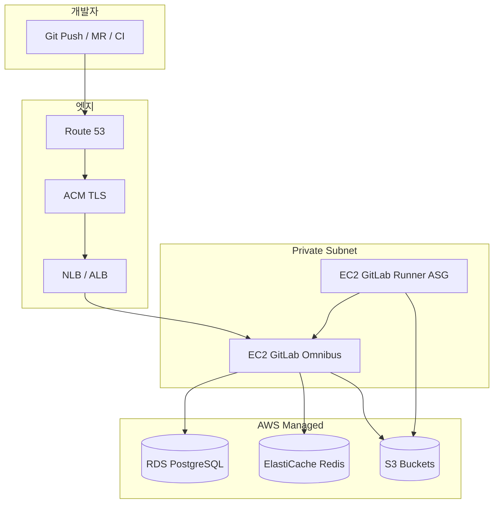

# AWS에 가장 효율적인 GitLab CE 구성하기 — 비용·성능·HA까지 2026 실전 가이드

팀이 커지면 GitHub 유료 플랜·Runner 분·프라이빗 레지스트리 비용이 빠르게 늘어납니다. **GitLab Community Edition(CE)** 은 셀프호스트 시 **코어 DevOps 기능을 라이선스 비용 없이** 쓸 수 있어, AWS에 올려두면 “우리만의 CI/CD 허브”가 됩니다.

다만 **효율적**이라는 말은 “가장 싼 EC2”가 아닙니다.

> **앱은 EC2, 상태는 RDS·ElastiCache·S3, CI는 Runner 분리, 백업은 자동화**

[GitLab 공식 문서](https://docs.gitlab.com/administration/reference_architectures/)도 동일한 방향을 권장합니다. 번들 PostgreSQL·Redis 대신 **Amazon RDS·ElastiCache·S3**를 쓰고, 1,000명 이하라면 **단일 EC2 + 스냅샷 전략**으로 시작할 수 있습니다.

이 글은 팀 규모별로 **가장 비용 대비 성능이 좋은 GitLab CE AWS 구성**을 골라 설계·구축·운영하는 방법을 정리합니다.

> 컨테이너·배포 패턴은 [ECS Fargate 아키텍처](/2025/07/08/aws-saa-ecs-fargate-rds-web-architecture/)와 [Docker 배포 가이드](/2025/10/11-django-ninja-docker-deployment-guide/)를, IaC는 [CloudFormation/CDK](/2025/07/10/aws-saa-cloudformation-cdk-infrastructure-as-code/) 글과 함께 보면 좋습니다.

---

## 0. 결론부터: 규모별 “가장 효율적인” 선택

| 팀 규모 | 권장 구성 | HA | 월 비용 감각 (서울 리전) |
|---|---|---|---|
| **~30명, CI 가벼움** | EC2 1대 (Omnibus) + EBS 스냅샷 | ✗ | $80~150 |
| **~100명, 프로덕션 CI** | EC2 + **RDS** + **ElastiCache** + **S3** | ✗ | $250~450 |
| **~300명, 24/7** | EC2 ASG(2) + RDS Multi-AZ + S3 + NLB | △ (앱만) | $600~1,000 |
| **1,000명+ / HA 필수** | [Reference Architecture](https://docs.gitlab.com/administration/reference_architectures/) + **GET** | ✓ | $2,000+ |

**CE 사용자에게 가장 흔한 sweet spot**은 두 번째 줄입니다. **GitLab 앱은 EC2 한 대(또는 2대)**, **DB·캐시·오브젝트는 매니지드**로 빼는 구조입니다.

---

## 1. 왜 AWS + GitLab CE인가

### 1.1 CE로 가능한 것 (2026 기준 핵심)

| 기능 | CE |
|---|---|
| Git 저장소·MR·코드 리뷰 | ✓ |
| CI/CD (`.gitlab-ci.yml`) | ✓ |
| Container Registry | ✓ |
| 이슈·보드 (기본) | ✓ |
| 보안 스캔 일부 | 제한 (Ultimate 기능은 유료) |

소규모·중소 팀의 **빌드·배포·레지스트리**에는 CE만으로 충분한 경우가 많습니다.

### 1.2 AWS를 쓰는 이유

| 이점 | 설명 |
|---|---|
| **RDS/ElastiCache** | DB·Redis 패치·백업 자동화 |
| **S3** | 아티팩트·LFS·백업 — GB당 저렴 |
| **IAM Role** | EC2에 키 없이 S3 접근 |
| **ASG + Runner** | CI 부하만 탄력 확장 |
| **서울 리전** | 국내 팀 지연 시간 |

---

## 2. 효율적인 아키텍처 한 장

### 2.1 권장 구성 (100명 내외 팀)



### 2.2 GitLab 컴포넌트 ↔ AWS 서비스 매핑

| GitLab 역할 | 비효율 (올인원 디스크) | **효율 (권장)** |
|---|---|---|
| PostgreSQL | Omnibus 내장 DB | **RDS PostgreSQL** |
| Redis | Omnibus 내장 | **ElastiCache Redis** |
| 아티팩트·LFS·업로드 | 로컬 디스크 | **S3** |
| Container Registry | 로컬 디스크 | **S3 (registry backend)** |
| 백업 | 수동 tarball | **S3 + RDS 스냅샷** |
| CI 실행 | GitLab EC2에서 빌드 | **별도 Runner EC2/ASG** |

공식 AWS 솔루션 가이드도 동일하게 **RDS + ElastiCache + S3 + ELB** 조합을 검증했습니다. ([Provision GitLab on AWS](https://docs.gitlab.com/solutions/cloud/aws/gitlab_instance_on_aws/))

---

## 3. 네트워크 설계 (VPC)

### 3.1 CIDR 예시 (ap-northeast-2)

| 리소스 | AZ-a | AZ-c |
|---|---|---|
| Public `10.0.0.0/24` | NLB, NAT | NLB |
| Private App `10.0.10.0/24` | GitLab EC2 | GitLab EC2 (선택) |
| Private Runner `10.0.20.0/24` | Runner | Runner ASG |
| DB `10.0.30.0/24` | RDS | RDS standby |

- GitLab·Runner·RDS는 **Private Subnet**
- NLB만 Public (또는 ALB + ACM)
- Runner가 외부 이미지 pull 시 **NAT Gateway** 1개 (비용 주의 — [VPC 엔드포인트](https://docs.aws.amazon.com/vpc/latest/privatelink/vpc-endpoints-s3.html)로 S3/ECR 트래픽 절감)

### 3.2 보안 그룹 (최소)

```yaml
gitlab-sg:
  inbound:
    - port 443 from nlb-sg
    - port 22 from bastion-sg only
  outbound: all (또는 RDS/Redis/S3 엔드포인트만)

rds-sg:
  inbound:
    - port 5432 from gitlab-sg, runner-sg

elasticache-sg:
  inbound:
    - port 6379 from gitlab-sg
```

---

## 4. 컴퓨트 사이징 — Reference Architecture 기준

[GitLab Reference Architectures](https://docs.gitlab.com/administration/reference_architectures/)의 **1,000 users / 20 RPS** 를 소규모 프로덕션 출발점으로 씁니다.

### 4.1 EC2 (GitLab 앱 노드)

| 프로필 | 인스턴스 | vCPU | RAM | 용도 |
|---|---|---|---|---|
| **스타터** | `m7i.large` | 2 | 8 GiB | ~50명, CI 적음 |
| **권장** | `m7i.xlarge` | 4 | 16 GiB | ~100~200명 |
| **CI 분리 후** | `m7i.large` | 2 | 8 GiB | 앱만 (Runner 별도) |

- 디스크: **gp3 100~200GB** (로그·잠깐의 로컬 캐시; 대용량은 S3)
- **Reserved Instance (1년)** 적용 시 컴퓨트 30~40% 절감

### 4.2 RDS PostgreSQL

| 항목 | 권장 |
|---|---|
| 엔진 | PostgreSQL **16+** (GitLab 19.x는 PG 17 권장 — [GET 3.10](https://gitlab.com/gitlab-org/gitlab-environment-toolkit) 참고) |
| 클래스 | `db.m7g.large` (2 vCPU, 8 GiB) 시작 |
| 스토리지 | gp3 100GB, autoscaling |
| Multi-AZ | 100명 미만 단일 AZ 가능 / 프로덕션은 Multi-AZ |
| 파라미터 | `max_connections` GitLab 튜닝 가이드 따름 |

> **RDS Proxy**는 GitLab 공식 **미검증**. 직접 RDS 연결 + PgBouncer(Omnibus 내장) 조합이 일반적입니다.

### 4.3 ElastiCache Redis

| 항목 | 권장 |
|---|---|
| 엔진 | Redis 7.x |
| 노드 | `cache.t4g.medium` (스타터) → `cache.m7g.large` |
| 클러스터 | 단일 노드로 시작, HA 필요 시 replication group |

### 4.4 S3 버킷 분리

| 버킷 | 용도 |
|---|---|
| `gl-artifacts-{account}` | CI 아티팩트 |
| `gl-lfs-{account}` | Git LFS |
| `gl-uploads-{account}` | 업로드 |
| `gl-registry-{account}` | Container Registry |
| `gl-backups-{account}` | `gitlab-backup` |

**수명 주기**: 아티팩트 30~90일 만료, 백업은 Glacier 전환.

---

## 5. IAM — 키 없이 S3 접근

EC2 인스턴스 프로필에 최소 권한 정책을 붙입니다. ([공식 POC 가이드](https://docs.gitlab.com/install/aws/) 동일 패턴)

```json
{
  "Version": "2012-10-17",
  "Statement": [
    {
      "Effect": "Allow",
      "Action": ["s3:PutObject", "s3:GetObject", "s3:DeleteObject"],
      "Resource": "arn:aws:s3:::gl-*/*"
    },
    {
      "Effect": "Allow",
      "Action": [
        "s3:ListBucket",
        "s3:AbortMultipartUpload",
        "s3:ListMultipartUploadParts"
      ],
      "Resource": "arn:aws:s3:::gl-*"
    }
  ]
}
```

`gitlab.rb`에는 **Access Key를 넣지 않고** `use_iam_profile true`를 사용합니다.

---

## 6. GitLab 설정 (`gitlab.rb`) — 효율 구성 핵심

### 6.1 외부 DB·Redis·S3 연결

```ruby
# /etc/gitlab/gitlab.rb (발췌)

external_url 'https://gitlab.example.com'

# PostgreSQL → RDS
gitlab_rails['db_adapter'] = 'postgresql'
gitlab_rails['db_host'] = 'gitlab.xxxxx.ap-northeast-2.rds.amazonaws.com'
gitlab_rails['db_port'] = 5432
gitlab_rails['db_database'] = 'gitlabhq_production'
gitlab_rails['db_username'] = 'gitlab'
gitlab_rails['db_password'] = '{{ Secrets Manager에서 주입 }}'

# Redis → ElastiCache
gitlab_rails['redis_host'] = 'gitlab.xxxxx.cache.amazonaws.com'
gitlab_rails['redis_port'] = 6379

# Object Storage → S3 (통합 설정 예시)
gitlab_rails['object_store']['enabled'] = true
gitlab_rails['object_store']['connection'] = {
  'provider' => 'AWS',
  'region' => 'ap-northeast-2',
  'use_iam_profile' => true
}
gitlab_rails['object_store']['objects']['artifacts']['bucket'] = 'gl-artifacts-123456'
gitlab_rails['object_store']['objects']['lfs']['bucket'] = 'gl-lfs-123456'
gitlab_rails['objects']['uploads']['bucket'] = 'gl-uploads-123456'

# Container Registry
registry['enable'] = true
gitlab_rails['registry_enabled'] = true
gitlab_rails['registry_bucket'] = 'gl-registry-123456'
```

적용:

```bash
sudo gitlab-ctl reconfigure
sudo gitlab-ctl restart
```

### 6.2 내장 PostgreSQL·Redis 비활성화

RDS/ElastiCache로 옮긴 뒤에는 Omnibus 번들 서비스를 끕니다.

```ruby
postgresql['enable'] = false
redis['enable'] = false
```

이렇게 해야 **EC2 메모리를 앱·Sidekiq·Gitaly에 집중**할 수 있습니다.

### 6.3 Sidekiq·Puma 튜닝 (m7i.xlarge 예)

```ruby
puma['worker_processes'] = 4
sidekiq['max_concurrency'] = 20
```

실제 값은 `htop`, Prometheus, GitLab Performance Monitoring으로 조정합니다.

---

## 7. GitLab Runner — 비용 효율의 핵심

**GitLab EC2에서 CI까지 돌리면** push 한 번에 웹 UI가 느려집니다. Runner를 분리하는 것이 **가성비 최고**입니다.

### 7.1 Runner 배치 옵션

| 방식 | 비용 | 적합 |
|---|---|---|
| **EC2 1대 (always on)** | 중 | 빌드 24시간, 팀 ~30명 |
| **ASG + Scheduled Scaling** | 중~저 | 업무시간 CI 집중 |
| **Spot 인스턴스 Runner** | **저** | 실패 재시도 가능한 빌드 |
| **Docker executor** | — | 대부분 팀 기본 |

### 7.2 Runner 등록 (Docker executor)

```bash
# Runner EC2에 설치
curl -L https://packages.gitlab.com/install/repositories/runner/gitlab-runner/script.deb.sh | sudo bash
sudo apt-get install gitlab-runner

sudo gitlab-runner register \
  --url https://gitlab.example.com \
  --token <RUNNER_TOKEN> \
  --executor docker \
  --docker-image docker:27-dind \
  --description "aws-docker-spot"
```

`/etc/gitlab-runner/config.toml`:

```toml
concurrent = 4

[[runners]]
  name = "aws-docker"
  url = "https://gitlab.example.com"
  token = "..."
  executor = "docker"
  [runners.docker]
    image = "docker:27"
    privileged = true
    volumes = ["/cache", "/var/run/docker.sock:/var/run/docker.sock"]
  [runners.cache]
    Type = "s3"
    Shared = true
    [runners.cache.s3]
      BucketName = "gl-runner-cache-123456"
      BucketLocation = "ap-northeast-2"
```

**S3 distributed cache**를 쓰면 Runner ASG 확장 시 캐시 hit률이 올라가 빌드 시간·비용이 줄어듭니다.

### 7.3 `.gitlab-ci.yml` 효율 팁

```yaml
default:
  image: python:3.12-slim
  cache:
    key: ${CI_COMMIT_REF_SLUG}
    paths:
      - .pip-cache/
  tags:
    - aws-docker

stages: [test, build, deploy]

test:
  stage: test
  script:
    - pip install -r requirements.txt -q --cache-dir .pip-cache
    - pytest -q
  rules:
    - if: $CI_PIPELINE_SOURCE == "merge_request_event"

build:
  stage: build
  script:
    - docker build -t $CI_REGISTRY_IMAGE:$CI_COMMIT_SHA .
    - docker push $CI_REGISTRY_IMAGE:$CI_COMMIT_SHA
  rules:
    - if: $CI_COMMIT_BRANCH == $CI_DEFAULT_BRANCH
```

- **MR에서만 test**, main에서만 **build/push** — Runner 분 절약
- **interruptible: true** — 새 파이프라인 시 이전 job 취소

---

## 8. 프로비저닝 방법 — 무엇을 쓸까

### 8.1 방법 비교

| 방법 | 난이도 | 효율 | 비고 |
|---|---|---|---|
| **수동 Omnibus + 콘솔** | 하 | POC | 1~2일 실습 |
| **공식 AWS POC 가이드** | 중 | 학습 | HA 아님 |
| **[GitLab Environment Toolkit (GET)](https://gitlab.com/gitlab-org/gitlab-environment-toolkit)** | 상 | **프로덕션** | Terraform + Ansible |
| **자체 Terraform 모듈** | 상 | 맞춤 | GET 포크 가능 |

1,000명 이하·**HA 불필요** → EC2 1대 + EBS 스냅샷도 공식 권장입니다.

1,000명 이상 또는 **Gitaly Cluster HA** → **GET**이 사실상 표준입니다.

### 8.2 GET 한 줄 개요

```bash
# 개념 흐름
git clone https://gitlab.com/gitlab-org/gitlab-environment-toolkit.git
cd gitlab-environment-toolkit
# terraform/environments/ 에 aws 환경 변수 정의
terraform init && terraform apply
# ansible로 gitlab.rb 배포·클러스터 구성
```

GET은 Reference Architecture 사이즈(2K, 3K, 5K users…)를 **변수로 선택**하게 되어 있어, 처음부터 과대 프로비저닝하지 않게 돕습니다.

---

## 9. 비용 최적화 체크리스트

### 9.1 즉시 적용 (효과 큼)

| 항목 | 절감 |
|---|---|
| Runner를 GitLab EC2에서 **분리** | 앱 인스턴스 다운사이징 |
| 아티팩트·LFS → **S3** + lifecycle | EBS 용량·스냅샷 비용 |
| **Graviton (m7g/r7g)** | x86 대비 10~20% |
| EC2 **1년 RI** | 온디맨드 대비 ~35% |
| Runner **Spot** | CI 컴퓨트 ~70% |
| NAT 대신 **S3/ECR VPC Endpoint** | NAT GB당 과금 절감 |

### 9.2 월 비용 대략 (서울, 100명 팀, Runner 분리)

| 리소스 | 스펙 | 월 (USD) |
|---|---|---|
| EC2 GitLab | m7i.xlarge on-demand | ~140 |
| RDS | db.m7g.large Single-AZ | ~120 |
| ElastiCache | cache.t4g.medium | ~50 |
| S3 + 전송 | 200GB | ~20 |
| NLB | 1개 | ~25 |
| Runner | m7i.large 8h/day Spot | ~40 |
| **합계** | | **~400** |

팀 규모·빌드 빈도에 따라 2~3배까지 변동합니다. **CloudWatch Cost Anomaly** 알람을 꼭 켜세요.

### 9.3 비효율 패턴 (피하기)

| 패턴 | 문제 |
|---|---|
| Omnibus 올인원 + 거대 EBS | 백업·복구 느림, 디스크 비쌈 |
| GitLab EC2에서 Docker 빌드 | UI·Git 응답 지연 |
| 아티팩트 무제한 보관 | S3 비용 선형 증가 |
| t3.micro에 GitLab | 메모리 부족·OOM |
| 퍼블릭 RDS/Redis | 보안 사고 |

---

## 10. 백업·복구·업그레이드

### 10.1 백업 (3-2-1)

```bash
# /etc/cron.d/gitlab-backup
0 3 * * * root /opt/gitlab/bin/gitlab-backup create CRON=1
```

- `gitlab.rb`에 `gitlab_rails['backup_upload_connection']` → **S3**
- RDS **자동 스냅샷** 7~35일
- `gitlab-secrets.json` · `gitlab.rb` → **Secrets Manager** 별도 보관

### 10.2 복구 드릴

분기 1회 **스테이징 VPC**에서 restore 테스트. “백업은 있는데 복구를 안 해봤다”는 가장 비싼 실수입니다.

### 10.3 업그레이드

```bash
# 메이저 업그레이드 전
sudo gitlab-ctl stop puma sidekiq
sudo gitlab-backup create
sudo apt-get install gitlab-ce=<target-version>
sudo gitlab-ctl reconfigure
sudo gitlab-rake gitlab:check SANITIZE=true
```

PostgreSQL 메이저 버전은 **RDS 파라미터·호환 매트릭스**를 먼저 확인합니다.

---

## 11. 보안·관측

| 영역 | 권장 |
|---|---|
| TLS | **ACM** + NLB |
| 비밀 | **Secrets Manager** → `gitlab.rb` 템플릿 |
| 암호화 | RDS·S3 **KMS** |
| SSH | SSM Session Manager (22 닫기) |
| 로그 | CloudWatch Logs agent / OTLP |
| 메트릭 | GitLab Prometheus + CloudWatch 알람 (디스크, RDS CPU, Redis 메모리) |

### 11.1 필수 알람

- EC2 `StatusCheckFailed`
- RDS `FreeStorageSpace` < 20%
- ElastiCache `Evictions` > 0
- GitLab **Sidekiq queue size** 급증

---

## 12. 단계별 구축 로드맵

### Phase 1 (1~3일): POC

1. EC2 1대 `m7i.large` + Omnibus
2. Route 53 + ACM
3. 팀 5명 pilot, Runner 동일 EC2

### Phase 2 (1주): 효율 구성

1. RDS + ElastiCache 마이그레이션
2. S3 object storage 연결
3. Runner EC2 분리
4. 백업 S3 cron

### Phase 3 (2~4주): 프로덕션

1. NLB + Private subnet
2. ASG Runner + Spot
3. Terraform(GET)으로 IaC화
4. 복구 드릴

---

## 13. 흔한 실수 10가지

1. **CE 한계 무시** — 필요한 보안 기능이 Ultimate 전용인지 사전 확인  
2. **국내선… 아님 단일 AZ RDS를 프로덕션 최종** — Multi-AZ 검토  
3. **gitlab-secrets 분실** — 복구 불가  
4. **Runner privileged Docker** — 격리·네트워크 정책 필수  
5. **S3 퍼블릭 버킷** — Block Public Access  
6. **디스크 full** — 로그 로테이션·아티팩트 S3  
7. **버전 스큐** — GitLab·PG·Redis 호환 표 미확인  
8. **NAT 없이 Runner** — pull 실패  
9. **과소 사양 t 시리즈** — CPU 크레딧 고갈  
10. **모니터링 없이 스케일** — RPS·Sidekiq 보고 판단

---

## 14. 정리

AWS에서 **가장 효율적인 GitLab CE** 란:

> **Omnibus는 “앱 실행”만, PostgreSQL·Redis·파일은 RDS·ElastiCache·S3로 분리하고, CI는 Runner를 Spot·ASG로 탄력 운영한다.**

1. **~100명**이면 `m7i.xlarge` + `db.m7g.large` + `cache.t4g.medium` + S3 5버킷  
2. **Runner 분리 + S3 cache**가 체감 성능·비용 모두 1순위  
3. **HA·1,000명+**는 Reference Architecture + GET  
4. **백업·복구 드릴·업그레이드 절차**를 문서화한 팀이 장기적으로 가장 싸다  

오늘 시작한다면: **EC2 1대에 Omnibus 띄우고**, 이번 주 안에 **RDS와 S3 아티팩트만 분리**해 보세요. 그 한 단계가 “효율적인 AWS GitLab”의 80%입니다.

---

## 참고 자료

- [GitLab Reference Architectures](https://docs.gitlab.com/administration/reference_architectures/)
- [Installing GitLab POC on AWS](https://docs.gitlab.com/install/aws/)
- [Provision GitLab Instances on AWS](https://docs.gitlab.com/solutions/cloud/aws/gitlab_instance_on_aws/)
- [GitLab Environment Toolkit](https://gitlab.com/gitlab-org/gitlab-environment-toolkit)
- [GitLab backup & restore](https://docs.gitlab.com/administration/backup_restore/)
- [GitLab Runner autoscale on AWS](https://docs.gitlab.com/runner/runners/autoscale/)

---

## 관련 글

- [AWS ECS Fargate + RDS 웹 아키텍처](/2025/07/08/aws-saa-ecs-fargate-rds-web-architecture/)
- [CloudFormation/CDK IaC](/2025/07/10/aws-saa-cloudformation-cdk-infrastructure-as-code/)
- [Django Ninja Docker 배포](/2025/10/11-django-ninja-docker-deployment-guide/)
- [S3 + CloudFront 정적 호스팅](/2025/08/24-s3-cloudfront-static-website-hosting/)
- [Dockerfile 완전 가이드](/2025/12/19-dockerfile-complete-guide-from-basics-to-advanced/)
- [Django Ninja 고트래픽 최적화](/2026/01/14-django-ninja-high-traffic-optimization-strategies/)
