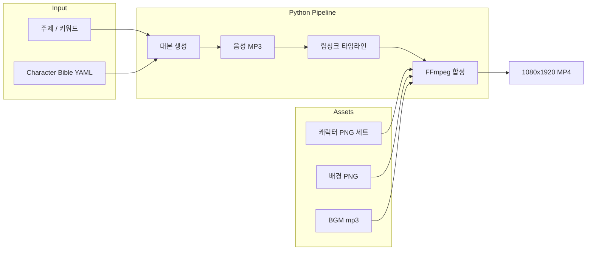

# 동물 캐릭터 릴스 효율 제작 & 코딩 자동화 — 2D 마스코트부터 AI 파이프라인까지 2026

“고양이 캐릭터가 말하는 릴스” “강아지가 오늘의 팁 알려주는 30초” — **동물 캐릭터 숏폼**은 저장·공유율이 높고, 브랜드·교육·쇼핑몰·로컬 업체 홍보에 잘 맞습니다.

하지만 한 편마다 **캐릭터 그리기 → 대본 → 녹음 → 입 움직임 → 자막 → BGM**을 반복하면 금방 지칩니다.

> **효율의 핵심**은 매번 새 캐릭터를 만드는 게 아니라,  
> **같은 캐릭터 + 같은 포맷 + 자동화 가능한 구간**을 최대화하는 것입니다.

이 글은 **수동으로 빠르게 만드는 워크플로**와 **코딩으로 자동화하는 파이프라인**을 나눠 설명하고, **어디까지 코드로 가능한지** 솔직하게 정리합니다.

> 업체 홍보용 슬라이드 릴스 파이프라인은 [업체 릴스 자동 제작기](/2026/06/09-business-promo-reels-auto-generator-guide/), TTS 백엔드는 [Django Ninja STT/TTS](/2026/01/27-django-ninja-stt-tts-production/), 인스타 전략은 [인스타 마케팅 가이드](/2026/03/22-instagram-marketing-beginner-guide/)를 함께 보면 좋습니다.

---

## 0. 결론부터: 효율 3단 + 자동화 가능 범위

### 효율 제작 3단

```
① 캐릭터 고정 (Character Bible 1벌)
  → ② 포맷 고정 (릴스 템플릿 3종)
    → ③ 대본만 바꿔 양산 (주 5~7편)
```

### 자동화 가능 범위 (2026 현실)

| 구간 | 자동화 | 도구 |
|---|---|---|
| **대본** | ◎ 90% | LLM + 캐릭터 페르소나 프롬프트 |
| **음성** | ◎ 95% | TTS (캐릭터별 voice preset) |
| **자막** | ◎ 95% | SRT/ASS 생성 |
| **배경·장면** | ○ 70% | 템플릿 PNG / AI 배경 |
| **캐릭터 표정·포즈** | ○ 60% | 스프라이트 세트 / AI 일관성 |
| **립싱크** | △ 50~80% | Rhubarb / Wav2Lip / 단순 입 3장 |
| **표정·연기 퀄리티** | △ 30% | 수동 보정 또는 Live2D |
| **바이럴 창의성** | ✗ | 사람 기획 필수 |

**코딩 자동화의 sweet spot**: **“교육·팁·브랜드 정보를 말하는 20~40초 2D 캐릭터 토크 릴스”**.  
**한계**: 매 편 완전 다른 연출·드라마틱 액션은 아직 **반자동 + 편집자 1명**이 현실적입니다.

---

## 1. 동물 캐릭터 릴스 유형 — 어떤 방식이 효율적인가

| 유형 | 제작 난이도 | 양산성 | 자동화 | 적합 |
|---|---|---|---|---|
| **A. 2D 스프라이트 + 입 3장** | 하 | ◎ | ◎ | 팁·정보·브랜드 |
| **B. AI 일러스트 + Ken Burns** | 하 | ○ | ○ | 분위기·스토리 |
| **C. Live2D / Rive 리깅** | 중~상 | ○ | △ | IP·시리즈 |
| **D. AI 영상 (Runway/Kling 등)** | 중 | △ | △ | 실험·훅 1컷 |
| **E. 실사 + 캐릭터 스티커** | 하 | ◎ | ○ | 리액션·밈 |

**양산·코딩 자동화 1순위**: **A (2D 스프라이트)**  
**팔로워 성장 + 브랜드**: **A + C 혼합** (주 5편 A, 월 1편 C)

---

## 2. 캐릭터 Bible — 한 번만 제대로 만들기

양산 전에 **캐릭터를 고정**합니다. 매 편 AI로 새 고양이를 그리면 **일관성·자동화** 모두 깨집니다.

### 2.1 Character Bible 템플릿

```yaml
name: "냥냥이 대리"
species: 고양이
personality: 츤데레, 정보 전달은 또박또박
speech_style: "~냥", 반말, 문장 짧게
visual:
  colors: ["#FFB347", "#FFFFFF", "#333333"]
  outfit: 노란 후드
  forbidden: "매번 다른 품종·색"
voice:
  tts: "nova"  # 또는 ElevenLabs voice_id
  speed: 1.08
formats:
  - "오늘의 한 줄 팁"
  - "틀린 vs 맞는"
  - "3초 퀴즈"
```

### 2.2 필수 에셋 세트 (2D 스프라이트)

| 파일 | 용도 |
|---|---|
| `char_neutral.png` | 기본, 투명 PNG |
| `char_mouth_open.png` | 말할 때 |
| `char_mouth_closed.png` | 무음 |
| `char_happy.png` | 긍정·마무리 |
| `char_think.png` | 질문·고민 |
| `bg_office.png` | 1080×1920 배경 1~3종 |

**한 벌만** 9:16에 맞춰 export. [업체 릴스 가이드](/2026/06/09-business-promo-reels-auto-generator-guide/)의 Ken Burns·슬라이드 로직을 **캐릭터 레이어**에 얹으면 됩니다.

### 2.3 AI로 캐릭터 만들 때 (일관성 팁)

- **Midjourney `--cref` / DALL·E character reference / Flux LoRA** 로 같은 얼굴 유지  
- “매 편 생성” 대신 **정면·측면·표정 6장**을 먼저 확정 → PNG로 고정  
- 상업 이용·저작권 **라이선스** 확인 (LoRA·스톡·자체 제작)

---

## 3. 릴스 포맷 3종 — 대본만 갈아끼우기

### 포맷 1: **「30초 팁」** (가장 양산하기 쉬움)

```
[0~3초]  훅: "아직도 ○○하고 있어?"
[3~25초] 팁 3개 (캐릭터 + 자막)
[25~30초] CTA: "저장해두면 나중에 편해~"
```

### 포맷 2: **「틀린 vs 맞는」**

```
[0초]   ❌ 틀린 방법 (캐릭터 sad)
[12초]  ✅ 맞는 방법 (캐릭터 happy)
[25초]  한 줄 요약
```

### 포맷 3: **「3초 퀴즈 → 정답」**

```
[0~5초]  질문 + 선택지 A/B
[5~8초]  "정답은…!"
[8~25초] 설명
```

**주간 캘린더 예**: 월·수·금 팁 / 화 퀴즈 / 목 틀린vs맞는 / 토·일 (휴 또는 재업)

---

## 4. 수동 제작 — 최단 워크플로 (1편 30분)

| 단계 | 도구 | 시간 |
|---|---|---|
| 대본 | ChatGPT + Character Bible | 5분 |
| 음성 | ElevenLabs / OpenAI TTS | 2분 |
| 립싱크 | CapCut 자동 / Rhubarb | 5분 |
| 합성 | CapCut / Canva 템플릿 | 15분 |
| 업로드 | 인스타·틱톡 | 3분 |

**CapCut 템플릿**에 캐릭터 PNG·자막 스타일을 저장해 두면 **15분/편**까지 가능합니다.

---

## 5. 코딩 자동화 — 파이프라인 설계

### 5.1 전체 아키텍처



[업체 릴스 자동 제작기](/2026/06/09-business-promo-reels-auto-generator-guide/)와 **동일한 뼈대**에 **캐릭터 레이어 + 립싱크**만 추가하면 됩니다.

### 5.2 프로젝트 구조

```
character-reels/
├── assets/
│   ├── cat/neutral.png
│   ├── cat/mouth_open.png
│   ├── backgrounds/office.png
│   └── bgm/calm.mp3
├── characters/
│   └── nyang.yaml          # Character Bible
├── templates/
│   └── tip_30s.yaml        # 포맷별 장면 정의
├── pipeline/
│   ├── script_gen.py       # LLM
│   ├── tts.py
│   ├── lipsync.py          # Rhubarb
│   ├── compose.py          # FFmpeg
│   └── render.py           # CLI 진입점
└── output/
```

### 5.3 LLM 대본 생성

```python
# pipeline/script_gen.py
import httpx

SYSTEM = """
당신은 {name}입니다. 종: {species}. 말투: {speech_style}
릴스 30초 분량. 문장 5~7개. 이모지 금지. TTS용 구어체.
포맷: {format_name}
주제: {topic}
출력: JSON {{ "lines": ["...", "..."], "hook": "..." }}
"""

async def generate_script(character: dict, topic: str, format_name: str) -> dict:
    prompt = SYSTEM.format(**character, topic=topic, format_name=format_name)
    # OpenAI / Claude API 호출
    ...
```

Character Bible을 YAML로 두면 **캐릭터 추가 = 파일 1개**입니다.

### 5.4 TTS — 캐릭터 보이스 preset

```python
# pipeline/tts.py — OpenAI TTS 예시
async def synthesize(text: str, out_path: str, voice: str = "nova", speed: float = 1.08):
    async with httpx.AsyncClient(timeout=60) as client:
        resp = await client.post(
            "https://api.openai.com/v1/audio/speech",
            headers={"Authorization": f"Bearer {API_KEY}"},
            json={
                "model": "gpt-4o-mini-tts",
                "voice": voice,
                "input": text,
                "response_format": "mp3",
                "speed": speed,
            },
        )
        resp.raise_for_status()
        Path(out_path).write_bytes(resp.content)
```

캐릭터마다 `voice`·`speed`를 Bible에 고정 → **브랜드 음성** 유지.

### 5.5 립싱크 — Rhubarb (오픈소스, 자동화 친화)

**Rhubarb Lip Sync**는 음성에서 **mouth cue (A~H, X)** 타임라인을 뽑습니다. 2D는 입 2~3장만 있어도 됩니다.

```bash
# 설치 후
rhubarb -f json -o cues.json voice.mp3
```

```json
[
  { "start": 0.0, "end": 0.12, "value": "X" },
  { "start": 0.12, "end": 0.35, "value": "D" },
  ...
]
```

Python에서 cue → `mouth_open` / `mouth_closed` 전환:

```python
# pipeline/lipsync.py
def cues_to_mouth_states(cues: list, fps: int = 30) -> list[str]:
    """프레임별 'open' | 'closed'"""
    frames = []
    for cue in cues:
        n = int((cue["end"] - cue["start"]) * fps)
        mouth = "open" if cue["value"] != "X" else "closed"
        frames.extend([mouth] * max(n, 1))
    return frames
```

**한계**: 감정·눈 깜빡임 없음. **팁·정보 릴스**에는 충분, 드라마엔 부족.

**고급**: Wav2Lip(얼굴 영상), SadTalker(정면 사진+음성) — GPU·품질 트레이드오프.

### 5.6 FFmpeg 합성 — 캐릭터 + 배경 + 자막

```python
# pipeline/compose.py — 개념: 프레임 시퀀스 → mp4
import subprocess
from pathlib import Path

def render_segment(
    bg: Path,
    char_closed: Path,
    char_open: Path,
    mouth_frames: list[str],
    duration: float,
    out: Path,
    fps: int = 30,
):
    """mouth_frames에 따라 open/closed PNG를 이어 붙여 클립 생성"""
    # 1) mouth_frames 길이만큼 PNG 시퀀스 생성 (Pillow composite)
    # 2) ffmpeg -framerate 30 -i frame_%04d.png -pix_fmt yuv420p segment.mp4
    ...
```

자막·BGM·음성 mux는 [업체 릴스 가이드 7~8장](/2026/06/09-business-promo-reels-auto-generator-guide/)과 동일:

```bash
ffmpeg -i video.mp4 -i voice.mp3 -i bgm.mp3 \
  -filter_complex "
    [1:a]volume=1[voice];
    [2:a]volume=0.15[bgm];
    [voice][bgm]amix=inputs=2:duration=first[aout];
    [0:v]subtitles=subs.ass[vout]
  " \
  -map "[vout]" -map "[aout]" -shortest -movflags +faststart final.mp4
```

### 5.7 CLI — 한 줄로 릴스 생성

```bash
python -m pipeline.render \
  --character characters/nyang.yaml \
  --format tip_30s \
  --topic "고양이 털 관리 여름철" \
  --output output/reel_001.mp4
```

**Celery + Django Ninja API**로 감싸면 [업체 릴스 SaaS](/2026/06/09-business-promo-reels-auto-generator-guide/)와 같은 **“주제만 넣으면 MP4”** 제품이 됩니다.

---

## 6. 자동화 수준별 로드맵

### Level 0 — 템플릿만 (코드 없음)

- CapCut/Canva 템플릿 + Character Bible
- **주 3~5편**, 1편 20~30분

### Level 1 — 스크립트 반자동

- LLM 대본 + TTS + 수동 CapCut
- **주 5~7편**, 1편 15분

### Level 2 — FFmpeg 파이프라인 (추천)

- LLM + TTS + Rhubarb + PNG 합성 + ASS 자막
- **주 7~14편**, 1편 **코드 2분 + 검수 5분**

### Level 3 — SaaS / 스케줄

- Django Ninja API + Celery + S3
- n8n/Celery Beat으로 **주제 큐 → 매일 1편 자동 렌더**
- [Celery Beat 가이드](/2026/03/24-django-ninja-celery-beat-complete-guide/) 참고

### Level 4 — AI 영상 (실험)

- Runway / Kling / Pika로 **캐릭터 3초 클립** 생성 → FFmpeg concat
- 비용·일관성·저작권 리스크 — **훅 1컷만** AI, 본문은 Level 2

---

## 7. 효율을 깨는 실수 vs 지키는 규칙

| 실수 | 대안 |
|---|---|
| 매 편 새 캐릭터 디자인 | Bible + 스프라이트 **1벌 고정** |
| 90초 스토리 | **20~40초** 정보형 |
| 립싱크 완벽주의 | 2D는 **입 2장 + Rhubarb**로 충분 |
| BGM·자막 매번 변경 | **프리셋 2종**만 |
| 조회수만 추적 | **저장·공유·프로필 방문** |
| AI 캐릭터 저작권 미확인 | 자작·라이선스·LoRA 약관 |

---

## 8. 비용·시간 (Level 2 기준, 1편)

| 항목 | 비용 | 시간 |
|---|---|---|
| LLM 대본 | ~₩20 | 10초 |
| TTS (~100자) | ~₩100 | 5초 |
| Rhubarb + FFmpeg (로컬) | ₩0 | 30~90초 |
| 사람 검수·썸네일 | — | 5분 |
| **합계** | **~₩150** | **~6분** |

CapCut만 쓸 때 30분 → 파이프라인 **6분** + 일관된 브랜드.

---

## 9. 확장 아이디어

| 방향 | 방법 |
|---|---|
| **다국어** | 같은 대본 JSON → TTS 3언어 → 자막 3버전 |
| **시리즈 IP** | 캐릭터 YAML 5개 = 5개 채널 |
| **B2B 납품** | 펫샵·동물병원·키즈 브랜드에 **월 N편 API** |
| **A/B 훅** | LLM으로 hook 3개 → 썸네일·첫 3초만 교체 |
| **교육·퀴즈** | 포맷 3 + DB 문제 bank |

[1인 구독 SaaS](/2026/06-01-ai-solo-founder-subscription-global-strategy/) 관점: **“월 29,000원 · 캐릭터 1마리 · 주 7릴스”** 플랜.

---

## 10. 90일 실행 계획

| 기간 | 할 일 |
|---|---|
| **1~2주** | Character Bible + PNG 6장 + 포맷 1종 |
| **3~4주** | CapCut 템플릿, 주 3편 업로드 |
| **5~8주** | Level 2 Python 파이프라인 (`render.py`) |
| **9~12주** | API·스케줄, KPI(저장률) 기반 포맷 조정 |

---

## 11. 정리

동물 캐릭터 릴스를 **효율적으로** 만든다는 것:

1. **캐릭터·포맷·음성**을 고정하고 **대본만 바꾼다**  
2. 2D 스프라이트 + Rhubarb + FFmpeg가 **자동화 sweet spot**  
3. **LLM·TTS·자막·합성**은 코드로 **80~90%** 가능  
4. **연출·바이럴 기획**은 사람 20%가 남는다  
5. [업체 릴스 파이프라인](/2026/06/09-business-promo-reels-auto-generator-guide/)에 **캐릭터 레이어**를 얹으면 제품화까지 이어진다  

오늘 시작: **고정 캐릭터 PNG 3장(무표정·입벌·웃음) + 30초 팁 포맷 1개 + TTS 1줄** → CapCut 또는 Python으로 **첫 MP4**를 뽑아보세요.

---

## 참고 자료

- [Rhubarb Lip Sync](https://github.com/DanielSWolf/rhubarb-lip-sync)
- [FFmpeg 공식 문서](https://ffmpeg.org/documentation.html)
- [OpenAI Text-to-Speech](https://platform.openai.com/docs/guides/text-to-speech)
- [Rive](https://rive.app/) — 웹·앱용 2D 리깅 (수동 후 export)

---

## 관련 글

- [업체 홍보 릴스 자동 제작기](/2026/06-09-business-promo-reels-auto-generator-guide/)
- [Django Ninja STT/TTS](/2026/01/27-django-ninja-stt-tts-production/)
- [인스타그램 마케팅 가이드](/2026/03/22-instagram-marketing-beginner-guide/)
- [고소작업차·릴스 마케팅 전략](/2026/06/12-aerial-work-platform-sky-marketing-reels-strategy/)
- [Django Ninja + Celery Beat](/2026/03/24-django-ninja-celery-beat-complete-guide/)
- [AI 1인 구독 SaaS](/2026/06-01-ai-solo-founder-subscription-global-strategy/)
