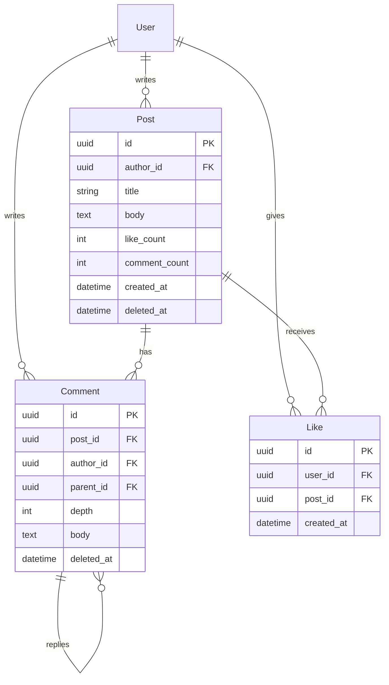

# Django Ninja로 커뮤니티 기능 만들기 — 글·댓글·좋아요, 시니어가 신경 쓰는 설계 2026

“게시글 CRUD + 댓글 + 좋아요” — 겉보기엔 **2~3일짜리 기능**입니다.

그런데 실서비스에 올리면 금방 이런 일이 생깁니다.

- 좋아요 수가 **실제와 1~2 차이**  
- 삭제한 글에 **댓글 알림**이 계속 감  
- 피드 API가 **포스트 20개에 쿼리 200번**  
- 악성 사용자가 **댓글 폭탄·HTML 삽입**  
- “대댓글 7단” UI가 **페이지 로딩 5초**

시니어 개발자는 **화면 기능 목록**보다 먼저 **실패 모드(failure mode)** 를 적습니다. 이 글은 Django Ninja로 **글쓰기·댓글·좋아요** 커뮤니티를 만들 때, 프로덕션에서 반드시 신경 써야 할 설계·코드·운영 포인트를 정리합니다.

> 트랜잭션·동시성은 [Django 트랜잭션 가이드](/2026/02/18-django-transaction-management-best-practices/), 인덱스·쿼리는 [DB 인덱싱](/2026/02/16-django-database-indexing-performance-optimization/)·[고트래픽 최적화](/2026/01/14-django-ninja-high-traffic-optimization-strategies/), 인증은 [JWT 가이드](/2026/02/26-django-nextjs-jwt-authentication-complete-guide/)와 함께 보세요.

---

## 0. 결론부터: 시니어 체크리스트 10가지

| # | 영역 | 한 줄 |
|---|---|---|
| 1 | **도메인** | Post·Comment·Like **분리**, 소프트 삭제 기본 |
| 2 | **권한** | 작성자·관리자·비공개 범위 **명시적** |
| 3 | **좋아요** | **유니크 제약 + idempotent API + 카운트 전략** |
| 4 | **댓글** | **depth 제한**, 트리 vs flat+path |
| 5 | **피드** | **cursor pagination**, N+1 제거 |
| 6 | **동시성** | `select_for_update` / `F()` / 트랜잭션 |
| 7 | **보안** | HTML sanitize, rate limit, CSRF/JWT |
| 8 | **모더레이션** | 신고·숨김·ban, 감사 로그 |
| 9 | **API** | Ninja Schema·Router 분리, 버전 |
| 10 | **관측** | 슬로우 쿼리, like drift 알람 |

---

## 1. 커뮤니티 기능의 범위 — MVP vs 프로덕션

### 1.1 MVP (1주)

- Post CRUD (제목·본문·작성자)
- Comment CRUD (1-depth 또는 대댓글 1단)
- Like toggle (게시글만)
- 목록 + offset pagination

### 1.2 프로덕션 (+2~4주)

| 추가 | 이유 |
|---|---|
| 소프트 삭제 | 복구·감사·연관 데이터 |
| 좋아요 **중복 방지 DB 제약** | race condition |
| **cursor** 피드 | offset 깊어질수록 느림 |
| 댓글 **depth cap** | 무한 트리 방지 |
| 신고·블라인드 | 운영 필수 |
| Rate limit | 스팸 |
| `like_count` **정합성** 전략 | denorm vs realtime |
| 알림 (선택) | 재방문 |

**시니어 조언**: MVP 스키마를 **처음부터 확장 가능하게** 짜되, **알림·검색·DM은 Phase 2**로 미룹니다.

---

## 2. 도메인 모델 — Post · Comment · Like

### 2.1 ERD (핵심)



### 2.2 모델 코드

```python
# community/models.py
import uuid
from django.conf import settings
from django.db import models
from django.utils import timezone

User = settings.AUTH_USER_MODEL


class SoftDeleteQuerySet(models.QuerySet):
    def alive(self):
        return self.filter(deleted_at__isnull=True)


class Post(models.Model):
    id = models.UUIDField(primary_key=True, default=uuid.uuid4, editable=False)
    author = models.ForeignKey(User, on_delete=models.CASCADE, related_name="posts")
    title = models.CharField(max_length=200)
    body = models.TextField()
    like_count = models.PositiveIntegerField(default=0)
    comment_count = models.PositiveIntegerField(default=0)
    is_pinned = models.BooleanField(default=False)
    created_at = models.DateTimeField(auto_now_add=True, db_index=True)
    updated_at = models.DateTimeField(auto_now=True)
    deleted_at = models.DateTimeField(null=True, blank=True, db_index=True)

    objects = SoftDeleteQuerySet.as_manager()

    class Meta:
        indexes = [
            models.Index(fields=["-created_at"], name="post_feed_idx"),
            models.Index(fields=["author", "-created_at"]),
        ]

    def soft_delete(self):
        self.deleted_at = timezone.now()
        self.save(update_fields=["deleted_at", "updated_at"])


class Comment(models.Model):
    MAX_DEPTH = 2  # 본댓글(0) → 대댓글(1) → 대대댓글(2)

    id = models.UUIDField(primary_key=True, default=uuid.uuid4, editable=False)
    post = models.ForeignKey(Post, on_delete=models.CASCADE, related_name="comments")
    author = models.ForeignKey(User, on_delete=models.CASCADE, related_name="comments")
    parent = models.ForeignKey(
        "self", null=True, blank=True, on_delete=models.CASCADE, related_name="replies"
    )
    depth = models.PositiveSmallIntegerField(default=0)
    body = models.TextField()
    like_count = models.PositiveIntegerField(default=0)
    created_at = models.DateTimeField(auto_now_add=True, db_index=True)
    deleted_at = models.DateTimeField(null=True, blank=True)

    objects = SoftDeleteQuerySet.as_manager()

    class Meta:
        indexes = [
            models.Index(fields=["post", "created_at"]),
            models.Index(fields=["post", "parent", "created_at"]),
        ]


class Like(models.Model):
    """게시글 좋아요 — 유저당 1번"""
    id = models.UUIDField(primary_key=True, default=uuid.uuid4, editable=False)
    user = models.ForeignKey(User, on_delete=models.CASCADE, related_name="likes")
    post = models.ForeignKey(Post, on_delete=models.CASCADE, related_name="likes")
    created_at = models.DateTimeField(auto_now_add=True)

    class Meta:
        constraints = [
            models.UniqueConstraint(fields=["user", "post"], name="uniq_user_post_like"),
        ]
        indexes = [
            models.Index(fields=["post", "created_at"]),
        ]
```

### 2.3 시니어가 모델에서 신경 쓰는 것

| 결정 | 권장 | 피하기 |
|---|---|---|
| PK | **UUID** (공개 URL·merge) | 연속 int 노출 |
| 삭제 | **soft delete** | hard delete만 |
| like_count | **denormalized + 주기 검증** | 매번 `COUNT(*)` |
| 댓글 트리 | **parent + depth cap** | 무한 재귀 |
| Comment Like | Phase 2 | MVP에 전부 넣기 |

---

## 3. Django Ninja API 구조

### 3.1 Router 분리

```python
# community/api.py
from ninja import Router
from ninja.security import HttpBearer
from .schemas import PostOut, PostIn, CommentOut, CommentIn

api = Router(tags=["community"])

posts_router = Router(tags=["posts"])
comments_router = Router(tags=["comments"])
likes_router = Router(tags=["likes"])

api.add_router("/posts", posts_router)
api.add_router("", comments_router)   # /posts/{id}/comments
api.add_router("", likes_router)      # /posts/{id}/like
```

### 3.2 Schema — 목록 vs 상세 분리

```python
# community/schemas.py
from ninja import Schema
from uuid import UUID
from datetime import datetime

class AuthorOut(Schema):
    id: UUID
    username: str
    avatar_url: str | None = None

class PostListOut(Schema):
    id: UUID
    title: str
    excerpt: str           # 본문 120자 — 목록용
    author: AuthorOut
    like_count: int
    comment_count: int
    liked_by_me: bool
    created_at: datetime

class PostDetailOut(PostListOut):
    body: str

class PostIn(Schema):
    title: str
    body: str

class CommentOut(Schema):
    id: UUID
    body: str
    author: AuthorOut
    depth: int
    parent_id: UUID | None
    like_count: int
    created_at: datetime
```

**시니어 포인트**: 목록 API에 **전문 body** 넣지 않기 — 대역폭·캐시 효율.

---

## 4. 글쓰기(Post) — 시니어가 챙기는 것

### 4.1 생성·수정·삭제

```python
# community/services/posts.py
from django.db import transaction
from django.shortcuts import get_object_or_404
from community.models import Post

@transaction.atomic
def create_post(*, author, title: str, body: str) -> Post:
    body = sanitize_html(body)  # XSS — 아래 8장
    return Post.objects.create(author=author, title=title.strip(), body=body)


def update_post(*, post: Post, actor, title: str, body: str) -> Post:
    assert_can_edit_post(post, actor)
    post.title = title.strip()
    post.body = sanitize_html(body)
    post.save(update_fields=["title", "body", "updated_at"])
    return post


@transaction.atomic
def delete_post(*, post: Post, actor) -> None:
    assert_can_edit_post(post, actor)
    post.soft_delete()
    # 댓글은 cascade hard 아님 — soft_delete 유지 or 일괄 숨김 task
```

### 4.2 권한

```python
def assert_can_edit_post(post: Post, user) -> None:
    if post.deleted_at:
        raise PermissionError("deleted")
    if post.author_id == user.id:
        return
    if user.is_staff:
        return
    raise PermissionError("forbidden")
```

| 규칙 | 설명 |
|---|---|
| **본인만 수정** | 기본 |
| **staff 삭제/숨김** | 모더레이션 |
| **삭제된 글** | 404 (일반), 410+reason (작성자) |

### 4.3 피드 API — cursor pagination

offset `?page=500` 은 **느려집니다**. `(created_at, id)` 커서를 씁니다.

```python
# community/api/posts.py
from ninja import Router, Query
from typing import List
from uuid import UUID
from datetime import datetime

posts_router = Router()

@posts_router.get("/", response=List[PostListOut])
def list_posts(
    request,
    cursor: datetime | None = None,
    limit: int = Query(20, le=50),
):
    qs = (
        Post.objects.alive()
        .select_related("author")
        .order_by("-created_at", "-id")
    )
    if cursor:
        qs = qs.filter(created_at__lt=cursor)

    posts = list(qs[: limit + 1])
    has_next = len(posts) > limit
    posts = posts[:limit]

    liked_ids = get_liked_post_ids(request.user, [p.id for p in posts])

    return [
        serialize_post_list(p, liked_by_me=p.id in liked_ids)
        for p in posts
    ]
```

**N+1 방지**: `select_related('author')`, 좋아요는 **`WHERE post_id IN (...)` 1쿼리**.

---

## 5. 댓글(Comment) — 트리·깊이·정렬

### 5.1 depth cap (필수)

```python
from django.db import models, transaction

@transaction.atomic
def create_comment(*, post: Post, author, body: str, parent: Comment | None) -> Comment:
    if post.deleted_at:
        raise ValueError("post_deleted")

    depth = 0
    if parent:
        if parent.post_id != post.id:
            raise ValueError("parent_mismatch")
        depth = parent.depth + 1
        if depth > Comment.MAX_DEPTH:
            raise ValueError("max_depth_exceeded")

    comment = Comment.objects.create(
        post=post, author=author, parent=parent, depth=depth, body=sanitize_html(body)
    )
    Post.objects.filter(pk=post.pk).update(
        comment_count=models.F("comment_count") + 1
    )
    return comment
```

### 5.2 목록 전략

| 방식 | 장점 | 단점 |
|---|---|---|
| **Flat + `parent_id`** | 쿼리 단순, 프론트 트리 조립 | 클라이언트 로직 |
| **Nested serializer** | UI 직관 | N+1·깊이 폭발 |
| **Adjacency + path materialized** | 대규모 | 복잡 |

**실무 추천**: **flat list** (`post_id` + `created_at`) → 프론트에서 트리 구성. depth ≤ 2면 충분.

### 5.3 삭제 정책

| 정책 | UX |
|---|---|
| **soft + "삭제된 댓글"** | 스레드 유지 |
| **hard delete** | 대댓글 orphan |
| **작성자만 삭제, staff 블라인드** | 모더레이션 |

`comment_count` 는 soft delete 시 **감소**시키되, 숨김 댓글도 “자리”를 남길지 제품 결정.

---

## 6. 좋아요(Like) — 시니어가 가장 신경 쓰는 부분

### 6.1 실패 모드

1. **Double click** → like 2번  
2. **동시 toggle** → count +2 / -1  
3. **UniqueViolation** 미처리 → 500  
4. **denorm drift** → count 99, 실제 100

### 6.2 Idempotent toggle (정석)

```python
# community/services/likes.py
from django.db import transaction, IntegrityError
from django.db.models import F
from community.models import Like, Post

@transaction.atomic
def toggle_like(*, user, post: Post) -> dict:
    if post.deleted_at:
        raise ValueError("post_deleted")

    existing = Like.objects.filter(user=user, post=post).first()
    if existing:
        existing.delete()
        Post.objects.filter(pk=post.pk).update(like_count=F("like_count") - 1)
        liked = False
    else:
        try:
            Like.objects.create(user=user, post=post)
        except IntegrityError:
            # 동시 요청 — 이미 좋아요됨 → idempotent success
            liked = True
        else:
            Post.objects.filter(pk=post.pk).update(like_count=F("like_count") + 1)
            liked = True

    post.refresh_from_db(fields=["like_count"])
    return {"liked": liked, "like_count": post.like_count}
```

**포인트**

- DB **`UniqueConstraint(user, post)`** 가 진실의 원천  
- `IntegrityError` → **200 + liked=true** (클라이언트 재시도 안전)  
- count는 **`F()` expression** — [트랜잭션 가이드](/2026/02/18-django-transaction-management-best-practices/) 참고  
- `like_count` 음수 방지: DB `CHECK (like_count >= 0)` 또는 주기 reconcile

### 6.3 Reconcile job (denorm 검증)

```python
# Celery task — 주 1회 or 알람 시
from django.db.models import Count, F

def reconcile_like_counts():
    drift = (
        Post.objects.alive()
        .annotate(real=Count("likes"))
        .exclude(like_count=F("real"))
    )
    for p in drift[:100]:
        Post.objects.filter(pk=p.pk).update(like_count=p.real)
```

[고트래픽 가이드](/2026/01/14-django-ninja-high-traffic-optimization-strategies/)처럼 **배치·캐시**를 섞을 수 있지만, **MVP는 DB denorm + reconcile**이 단순합니다.

### 6.4 Ninja 엔드포인트

```python
@likes_router.post("/posts/{post_id}/like")
def toggle_post_like(request, post_id: UUID):
    post = get_object_or_404(Post.objects.alive(), pk=post_id)
    result = toggle_like(user=request.user, post=post)
    return result
```

**PUT idempotent** vs **POST toggle** — 팀 컨vention 통일. 모바일은 **POST toggle**이 흔함.

---

## 7. 인증·권한 — Django Ninja

```python
# core/auth.py
from ninja.security import HttpBearer
from django.contrib.auth import get_user_model

class JWTAuth(HttpBearer):
    def authenticate(self, request, token):
        user = verify_access_token(token)  # simplejwt 등
        if user and user.is_active:
            return user
        return None

# api.py
api = NinjaAPI(auth=JWTAuth())
```

| 엔드포인트 | 인증 |
|---|---|
| GET 피드 (public) | optional — `liked_by_me` |
| POST 글·댓글·좋아요 | **required** |
| DELETE | author or staff |

[JWT 가이드](/2026/02/26-django-nextjs-jwt-authentication-complete-guide/)의 refresh rotation과 함께 설계.

---

## 8. 보안·모더레이션

### 8.1 XSS — 본문 sanitize

```python
import bleach

ALLOWED_TAGS = ["p", "br", "strong", "em", "a", "ul", "ol", "li", "code"]
ALLOWED_ATTRS = {"a": ["href", "title", "rel"]}

def sanitize_html(raw: str) -> str:
    return bleach.clean(raw, tags=ALLOWED_TAGS, attributes=ALLOWED_ATTRS, strip=True)
```

Markdown 렌더 시 **서버 sanitize** 필수. 프론트만 믿지 않기.

### 8.2 Rate limit

```python
from django_ratelimit.decorators import ratelimit

@ratelimit(key="user", rate="10/m", method="POST")
@posts_router.post("/", response=PostDetailOut)
def create_post_api(request, payload: PostIn):
    ...
```

| 액션 | 권장 |
|---|---|
| 글 작성 | 10/분 |
| 댓글 | 30/분 |
| 좋아요 | 60/분 |
| 로그인 실패 | IP별 |

### 8.3 신고·블라인드 (Phase 2 스키마)

```python
class Report(models.Model):
    reporter = models.ForeignKey(User, on_delete=models.CASCADE)
    post = models.ForeignKey(Post, null=True, on_delete=models.CASCADE)
    comment = models.ForeignKey(Comment, null=True, on_delete=models.CASCADE)
    reason = models.CharField(max_length=50)
    created_at = models.DateTimeField(auto_now_add=True)
```

staff 대시보드 or Django Admin + **감사 로그**.

---

## 9. 성능·인덱스

### 9.1 필수 인덱스

| 쿼리 | 인덱스 |
|---|---|
| 피드 `ORDER BY created_at DESC` | `(created_at DESC)` partial `deleted_at IS NULL` |
| 댓글 by post | `(post_id, created_at)` |
| liked by me | `(user_id, post_id)` unique |
| 작성자 글 | `(author_id, created_at)` |

[DB 인덱싱 가이드](/2026/02/16-django-database-indexing-performance-optimization/) 참고.

### 9.2 캐시 (트래픽 올라가면)

| 대상 | TTL |
|---|---|
| 인기글 Top 10 | 60s |
| post detail | 30s, invalidation on update |
| like_count | **캐시보다 DB denorm** 우선 |

### 9.3 읽기/쓰기 분리

댓글·좋아요 폭주 시 **read replica** + write master. [고트래픽 가이드](/2026/01/14-django-ninja-high-traffic-optimization-strategies/) 2단계.

---

## 10. 테스트 — 시니어 최소 세트

```python
import pytest
from concurrent.futures import ThreadPoolExecutor

@pytest.mark.django_db
def test_toggle_like_idempotent(client, user, post):
    client.force_login(user)
    r1 = client.post(f"/api/posts/{post.id}/like")
    r2 = client.post(f"/api/posts/{post.id}/like")
    assert r1.json()["liked"] is True
    assert r2.json()["liked"] is False
    post.refresh_from_db()
    assert post.like_count == 0

@pytest.mark.django_db
def test_concurrent_likes(user, post):
    def like_once():
        toggle_like(user=user, post=post)

    with ThreadPoolExecutor(max_workers=10) as ex:
        list(ex.map(lambda _: like_once(), range(10)))

    assert post.likes.count() == 1
    post.refresh_from_db()
    assert post.like_count == 1
```

| 케이스 | 검증 |
|---|---|
| soft delete post → comment 403 | |
| max depth 초과 | |
| non-author update 403 | |
| list N+1 | `assertNumQueries` |
| like reconcile | drift 0 |

---

## 11. API 설계 디테일

### 11.1 HTTP 상태 코드

| 상황 | 코드 |
|---|---|
| 생성 | 201 |
| 삭제 | 204 |
| soft deleted | 404 |
| 권한 없음 | 403 |
| validation | 422 (Ninja default) |
| rate limit | 429 |

### 11.2 에러 형식 통일

```python
from ninja.errors import HttpError

raise HttpError(403, "You cannot edit this post")
```

### 11.3 버전

`/api/v1/community/...` — 필드 추가는 하위 호환, breaking은 v2.

---

## 12. 멀티테넌시·커뮤니티

SaaS에서 **워크스pace별 게시판**이면 모든 쿼리에 `workspace_id` 필터:

```python
Post.objects.filter(workspace=request.workspace, ...)
```

[Workspace Multi-tenancy 가이드](/2026/01/21-django-ninja-workspace-based-multi-tenancy-authentication/)와 동일 패턴. **Like unique는 (workspace, user, post)** 또는 post가 workspace에 종속.

---

## 13. 흔한 실수 12가지

1. **Like without unique constraint**  
2. **offset pagination만** — deep page 지옥  
3. **list API에 body 전문**  
4. **hard delete post** — 댓글·알림 orphan  
5. **count = COUNT(*) 매 요청**  
6. **댓글 무한 depth**  
7. **sanitize 없음** — stored XSS  
8. **rate limit 없음** — 스팸  
9. **N+1 on author·liked**  
10. **IntegrityError 500**  
11. **staff 모더레이션 없음**  
12. **like_count 음수** — reconcile 없음

---

## 14. 90일 로드맵

| Phase | 기간 | 산출물 |
|---|---|---|
| **1 MVP** | 1~2주 | Post·Comment(1depth)·Like·JWT |
| **2 Production** | 3~5주 | cursor·soft delete·depth·sanitize·rate limit |
| **3 Scale** | 6~8주 | reconcile·캐시·신고 |
| **4 Growth** | 9~12주 | 알림·검색·이미지 첨부 |

---

## 15. 정리

Django Ninja로 커뮤니티를 만든다는 것은 **CRUD API 3개**가 아닙니다.

> **글·댓글·좋아요는 “소셜 상태”를 DB에 쌓는 일**이고,  
> 시니어는 **동시성·삭제·권한·피드 성능·악용**을 먼저 설계합니다.

1. **Post / Comment / Like** 분리 + **soft delete**  
2. **Like** = DB unique + **idempotent toggle** + `F()` + reconcile  
3. **Comment** = **depth cap** + flat list  
4. **Feed** = **cursor** + `select_related` + batch liked  
5. **보안** = sanitize + rate limit + staff 모더레이션  

오늘 바로: **`Like`에 `UniqueConstraint(user, post)` 추가**하고, `toggle_like`에 **`IntegrityError` 처리** 넣어 보세요. 커뮤니티 품질의 80%가 여기서 갈립니다.

---

## 참고 자료

- [Django Ninja 공식 문서](https://django-ninja.dev/)
- [bleach — HTML sanitization](https://github.com/mozilla/bleach)
- [PostgreSQL Partial Index](https://www.postgresql.org/docs/current/indexes-partial.html)

---

## 관련 글

- [Django 트랜잭션 관리](/2026/02/18-django-transaction-management-best-practices/)
- [Django DB 인덱싱](/2026/02/16-django-database-indexing-performance-optimization/)
- [Django Ninja 고트래픽](/2026/01/14-django-ninja-high-traffic-optimization-strategies/)
- [JWT 인증 (Django + Next.js)](/2026/02/26-django-nextjs-jwt-authentication-complete-guide/)
- [Workspace Multi-tenancy](/2026/01/21-django-ninja-workspace-based-multi-tenancy-authentication/)
- [Django Ninja Exception Handling](/2026/04/21-django-ninja-exception-handling/)
- [Django Ninja + Celery Beat](/2026/03/24-django-ninja-celery-beat-complete-guide/)
